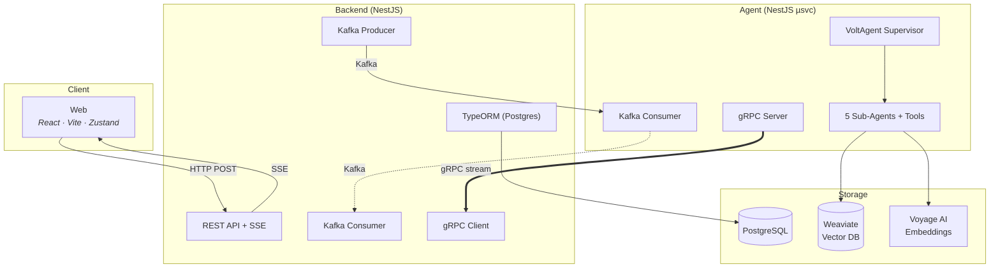
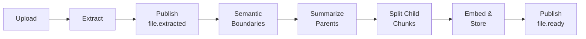
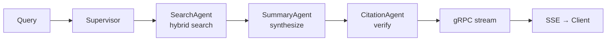
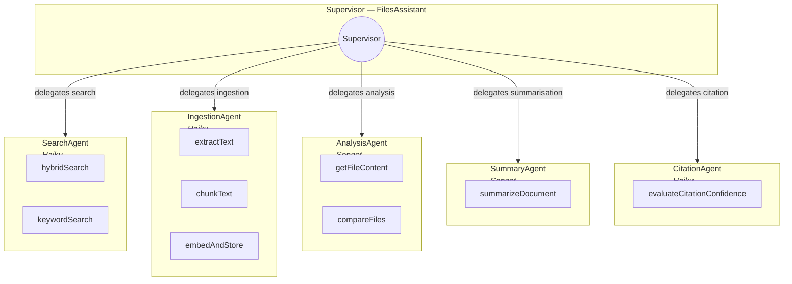

# Files Assistant

AI-powered files assistant that enables semantic search and Q&A over uploaded documents. Upload files (PDF, DOCX, plain text), the system extracts, chunks, and embeds the content, then a multi-agent AI system answers natural language questions grounded in the retrieved context (RAG).

## Architecture

Two independent services communicating through Redpanda (Kafka):

- **Backend** (`apps/backend`) -- NestJS CRUD API, Multer uploads, Swagger docs, SSE streaming
- **Agent** (`apps/agent`) -- VoltAgent multi-agent system (supervisor + 4 sub-agents), Kafka consumer
- **Agent Dev** (`apps/agent-dev`) -- Standalone VoltAgent dev server with VoltOps dashboard

Shared libraries:

- `libs/core` -- Pure TypeScript: ports, types, extraction, chunking
- `libs/events` -- Kafka event schemas (shared between services)
- `libs/weaviate` -- Weaviate client wrapper and collection schemas

## Prerequisites

- Node.js 22+
- pnpm 10+
- Docker & Docker Compose

## Quick Start

```bash
# Install dependencies
pnpm install

# Start infrastructure (PostgreSQL, Weaviate, Redpanda)
docker compose up -d

# Copy environment variables
cp .env.example .env
# Edit .env with your ANTHROPIC_API_KEY and VOYAGE_API_KEY

# Start backend API (:3000)
pnpm exec nx serve backend

# Start agent service (Kafka consumer)
pnpm exec nx serve agent

# Start agent dev server with VoltOps dashboard (:3141)
pnpm exec nx serve agent-dev
```

## Development Commands

```bash
# Serve
pnpm exec nx serve backend              # NestJS API (:3000)
pnpm exec nx serve agent                # Kafka consumer agent
pnpm exec nx serve agent-dev            # VoltAgent + VoltOps (:3141)

# Build
pnpm exec nx build backend --configuration=production
pnpm exec nx build agent --configuration=production

# Test
pnpm exec nx test core                  # libs unit tests
pnpm exec nx test events                # event schema tests
pnpm exec nx test backend               # backend tests
pnpm exec nx test agent                 # agent tests

# Affected (CI)
pnpm exec nx affected -t lint,test,build

# Dependency graph
pnpm exec nx graph
```

## API Documentation

When the backend is running, Swagger UI is available at:

```
http://localhost:3000/api/docs
```

### Endpoints

| Method   | Path                    | Description                        |
|----------|-------------------------|------------------------------------|
| `POST`   | `/api/files/upload`     | Upload a file for processing       |
| `GET`    | `/api/files`            | List files (paginated)             |
| `GET`    | `/api/files/:id`        | File details + status              |
| `DELETE` | `/api/files/:id`        | Delete file + vectors              |
| `GET`    | `/api/files/:id/events` | SSE: processing status             |
| `POST`   | `/api/chat`             | Send chat message                  |
| `GET`    | `/api/chat/stream/:id`  | SSE: stream response tokens        |
| `GET`    | `/api/chat/history`     | Conversation history               |
| `GET`    | `/api/health`           | Liveness probe                     |
| `GET`    | `/api/ready`            | Readiness probe                    |

## Infrastructure

```bash
docker compose up -d     # Start all services
docker compose down      # Stop all services
docker compose logs -f   # View logs
```

| Service           | Port  | Dashboard            |
|-------------------|-------|----------------------|
| PostgreSQL        | 5432  | --                   |
| Weaviate          | 8080  | --                   |
| Redpanda (Kafka)  | 19092 | --                   |
| Redpanda Console  | 8888  | http://localhost:8888|

## Project Structure

```
files-assistant/
  apps/
    backend/          NestJS CRUD API + Kafka producer
    agent/            VoltAgent multi-agent + Kafka consumer
    agent-dev/        VoltAgent standalone dev server
  libs/
    core/             Pure TS: ports, types, extraction, chunking
    events/           Kafka event schemas
    weaviate/         Weaviate client wrapper
```

## Tech Stack

| Layer              | Technology                                       |
|--------------------|--------------------------------------------------|
| Monorepo           | Nx 22, pnpm, TypeScript 5.9                      |
| Backend            | NestJS 11, TypeORM, Swagger, Multer              |
| Agent              | VoltAgent, @ai-sdk/anthropic, Zod                |
| Vector DB          | Weaviate (external vectors, hybrid search)        |
| Relational DB      | PostgreSQL 16                                    |
| Embeddings         | Voyage AI (`voyage-3-lite`)                      |
| LLM                | Anthropic Claude (Haiku + Sonnet via Vercel AI SDK) |
| Event Streaming    | Redpanda (Kafka-compatible)                      |
| RPC Streaming      | gRPC (protobuf `ChatStream` service)             |
| File Storage       | Local disk or S3 (configurable via `STORAGE_TYPE`) |

---

## System Design

### High-Level Architecture



### Service Responsibilities

| Service | Owns | Communicates via |
|---------|------|------------------|
| **Web** | UI, file uploads, chat interface, SSE subscriptions | HTTP → Backend |
| **Backend** | REST API, file metadata (Postgres), SSE streaming, Kafka fan-in/out, gRPC forwarding | HTTP, SSE, Kafka, gRPC |
| **Agent** | LLM orchestration, document extraction, chunking, embedding, RAG search, chat responses | Kafka, gRPC, Weaviate, Voyage |

### Transport Architecture

The system uses three transport layers with clearly separated concerns:

| Transport | Direction | Purpose |
|-----------|-----------|---------|
| **Kafka (Redpanda)** | Backend ↔ Agent | Durable async task dispatch (`file.uploaded`, `chat.request`) and status notifications (`file.ready`, `file.failed`, `file.extracted`) |
| **gRPC** | Agent → Backend | Real-time streaming of chat response tokens via `ChatStream.StreamChatResponse` |
| **SSE** | Backend → Web | Browser-compatible push for file processing events and chat response chunks |

**Why the split:** Kafka provides durability, retry semantics, and consumer-group scaling for work that doesn't need instant delivery. gRPC provides streaming with backpressure for response tokens where latency matters. SSE bridges gRPC to the browser, which cannot consume gRPC directly.

### Data Storage

| Store | Contents | Access Pattern |
|-------|----------|----------------|
| **PostgreSQL** | File metadata, chunk records, conversations, messages | TypeORM entities, migrations on startup |
| **Weaviate** | Vector-embedded document chunks (`FileChunks` collection) | Hybrid search (vector + BM25), parent/child chunk hierarchy |
| **Local/S3** | Raw uploaded files | Configurable via `STORAGE_TYPE` env; path stored in Postgres file record |

### Kafka Topics & Consumer Groups

| Topic | Producer | Consumer | Purpose |
|-------|----------|----------|---------|
| `file.uploaded` | Backend | Agent (`agent-workers`) | Trigger ingestion pipeline |
| `file.extracted` | Agent | Backend (`backend-notifications`) | Persist extracted text |
| `file.ready` | Agent | Backend (`backend-notifications`) | Mark file as searchable |
| `file.failed` | Agent | Backend (`backend-notifications`) | Record processing failure |
| `chat.request` | Backend | Agent (`agent-workers`) | Trigger chat response |
| `dlq.file.uploaded` | Agent | — (ops monitoring) | Poison message quarantine |
| `dlq.chat.request` | Agent | — (ops monitoring) | Poison message quarantine |

### Shared Libraries

| Library | Purpose | Key Exports |
|---------|---------|-------------|
| `libs/core` | Framework-agnostic types, ports, extractors, chunking | `EmbeddingPort`, `SearchPort`, `StoragePort`, `RecursiveTextChunker`, `AgentProcessingError` |
| `libs/events` | Kafka event contracts shared between services | `TOPICS`, `CONSUMER_GROUPS`, `DLQ_TOPICS`, Zod schemas, event factories |
| `libs/weaviate` | Weaviate collection schema and client helpers | `FILE_CHUNKS_COLLECTION`, `ensureFileChunksCollection` |
| `libs/proto` | gRPC service definition | `chat-stream.proto` — `ChatStream.StreamChatResponse` |

### Error Handling & Degradation

The system degrades gracefully rather than returning errors to the user:

| Tier | Response Type | Condition |
|------|--------------|-----------|
| 1 | Cited response (high confidence) | Citation confidence ≥ 0.7 |
| 2 | Cited response (low confidence) | Confidence < 0.7 after max retries (1) |
| 3 | Raw uncited response | CitationAgent failed but SummaryAgent output exists |
| 4 | Error response | Agent pipeline crashed entirely |

Ingestion failures are classified by stage (`extraction`, `chunking`, `embedding`) and published as `file.failed` events with specific error reasons. Poison messages are routed to dead-letter queues.

---

## Scenario — Test Coverage

### Testing Stack

| Layer | Framework | Runner |
|-------|-----------|--------|
| Unit tests | Jest + ts-jest | `pnpm exec nx test <project>` |
| Integration / E2E | Jest + supertest + Docker Compose | `pnpm exec nx e2e backend-e2e` |
| Test environment | `jest.preset.js` extends `@nx/jest/preset` | Node environment, per-project configs |

### Unit Tests — Agent (`apps/agent`)

**`ingestion.consumer.spec.ts`** — IngestionConsumer pipeline

| Scenario | Asserts |
|----------|---------|
| Full PDF pipeline | extract → `file.extracted` → chunk → embed → `file.ready` |
| TXT pipeline | `extractionMethod: 'raw'`, correct text passthrough |
| Extraction error | `file.failed` with `stage: 'extraction'` |
| Zero chunks produced | `file.failed` with `stage: 'chunking'`, no embed call |
| Embedding error | `file.failed` with `stage: 'embedding'` |
| Event ordering | `file.extracted` published before embedding begins |
| Generic errors | Non-`AgentProcessingError` → `file.failed` with `stage: 'extraction'` |
| Event payload fields | `file.extracted` and `file.ready` carry correct metadata |

Mocks: `extractTextTool.execute`, `KafkaEventAdapter` methods, `EMBEDDING_PORT`.

**`kafka-event.adapter.spec.ts`** — KafkaEventAdapter

| Scenario | Asserts |
|----------|---------|
| Correct topic | Sends to `file.extracted` |
| Message key | Uses `fileId` as partition key |
| Payload shape | JSON value includes all event fields |
| Timestamp | Auto-generated ISO timestamp within acceptable range |

Mocks: `kafkajs` Kafka constructor, `ConfigService`.

**`extract-text.tool.spec.ts`** — extractTextTool

| Scenario | Asserts |
|----------|---------|
| MIME routing | PDF → Anthropic Haiku; `text/plain`, `text/markdown`, `application/json` → raw read |
| PDF extraction | Correct document block shape, base64 encoding, prompt text |
| Raw extraction | UTF-8 preservation, correct `method` and `characterCount` |
| Empty Haiku response | Throws `AgentProcessingError` |
| Rate limit (429) | Throws retryable `AgentProcessingError` |
| File not found (ENOENT) | Throws non-retryable `AgentProcessingError` |
| Model env var | Respects `ANTHROPIC_HAIKU_MODEL` |

Mocks: `node:fs/promises`, injectable Anthropic client.

### Unit Tests — Backend (`apps/backend`)

**`files.service.spec.ts`** — FilesService

| Scenario | Asserts |
|----------|---------|
| Status updates | DB write for `EXTRACTING`, `EXTRACTED`, `EMBEDDING` |
| SSE intermediate events | Stream emits on non-terminal statuses, does not complete |
| SSE terminal `READY` | Stream emits and completes |
| SSE terminal `FAILED` | Stream emits error payload and completes |
| Full status progression | `PROCESSING` → `EXTRACTING` → `EXTRACTED` → `EMBEDDING` → `READY` emits 4 SSE events |
| Invalid transition | Warns via logger, still persists update |
| Filtered queries | `findAll` with `status=extracted` applies `andWhere` filter |

Mocks: TypeORM repositories (`FileEntity`, `ChunkEntity`), `KafkaProducerService`, `Logger.prototype.warn`.

### Unit Tests — Libraries

**`libs/events` — `file-extracted.event.spec.ts`**

| Scenario | Asserts |
|----------|---------|
| Topic constant | `TOPICS.FILE_EXTRACTED === 'file.extracted'` |
| Factory timestamp | `createFileExtractedEvent` sets valid ISO timestamp |
| Field passthrough | Factory preserves all input fields |
| Optional fields | `pageCount` present/absent handled correctly |

### E2E Tests (`apps/backend-e2e`)

Full integration tests against a real stack (Docker Compose with Postgres + Redpanda, mocked Anthropic + embeddings).

**`ingestion-happy-path.e2e-spec.ts`**

| Scenario | Asserts |
|----------|---------|
| PDF upload | Status `ready`, extraction method `haiku`, `parsedText` matches mock, `chunkCount > 0` |
| TXT upload | Status `ready`, extraction method `raw`, text matches fixture |
| MD upload | Status `ready`, markdown content preserved (headings, lists) |
| JSON upload | Status `ready`, `parsedText` parses as valid JSON |

**`ingestion-failure.e2e-spec.ts`**

| Scenario | Asserts |
|----------|---------|
| Corrupt PDF | Status `failed`, `errorStage: 'extraction'` |
| Embedding error | Status `failed`, `errorStage: 'embedding'`, DB has `parsedText` and `extractionMethod: 'raw'` |
| Empty file | Status `failed` |

**`ingestion-sse.e2e-spec.ts`**

| Scenario | Asserts |
|----------|---------|
| Successful upload | SSE statuses include `extracted` before `ready` |
| Stream closes after ready | SSE connection terminates after terminal event |
| Corrupt PDF failure | SSE closes after `failed` with error payload |

**`ingestion-kafka-events.e2e-spec.ts`**

| Scenario | Asserts |
|----------|---------|
| PDF event sequence | Topics `file.uploaded` → `file.extracted` → `file.ready` in order |
| Corrupt PDF events | `file.uploaded` + `file.failed` (stage `extraction`), no extracted/ready |
| TXT + embedding fail | `file.uploaded`, `file.extracted`, `file.failed` (stage `embedding`), no ready |

**`ingestion-rejection.e2e-spec.ts`**

| Scenario | Asserts |
|----------|---------|
| DOCX upload | 400 with unsupported type message |
| MP4 upload | 400 rejected |
| CSV upload | 400 rejected |
| XLSX upload | 400 rejected |
| EXE upload | 400 rejected |
| No file attached | 400 rejected |

### Coverage Gaps

| Area | Status |
|------|--------|
| `libs/core` (chunker, extractors, types) | Jest config present, **no spec files** |
| `libs/weaviate` (collection helpers) | Jest config present, **no spec files** |
| `apps/web` (React frontend) | **No test files** |
| Chat pipeline (E2E) | Not covered in E2E suite |
| WeaviateAdapter (hybrid/keyword search) | No dedicated unit tests |
| VoyageEmbeddingAdapter (embeddings) | No dedicated unit tests |

---

## AI Pipeline

### Overview

The AI pipeline has two main flows: **Ingestion** (document processing) and **RAG** (retrieval-augmented generation for chat). Both are orchestrated by the Agent service using VoltAgent's multi-agent framework with Anthropic Claude models.

### Models

| Role | Env Variable | Fallback Model | Used For |
|------|-------------|----------------|----------|
| Supervisor | `ANTHROPIC_SUPERVISOR_MODEL` | `claude-haiku-4-5-20251001` | Task routing and orchestration |
| Search Agent | `ANTHROPIC_SEARCH_MODEL` | `claude-haiku-4-5-20251001` | Search query processing |
| Ingestion Agent | `ANTHROPIC_INGESTION_MODEL` | `claude-haiku-4-5-20251001` | Document processing |
| Analysis Agent | `ANTHROPIC_ANALYSIS_MODEL` | `claude-sonnet-4-20250514` | Deep file analysis, comparison |
| Summary Agent | `ANTHROPIC_SUMMARY_MODEL` | `claude-sonnet-4-20250514` | Document summarization |
| Citation Agent | `ANTHROPIC_CITATION_MODEL` | `claude-haiku-4-5-20251001` | Citation scoring and verification |
| PDF Extraction | `ANTHROPIC_HAIKU_MODEL` | `claude-haiku-4-5-20251001` | PDF text extraction |
| Semantic Chunking | `ANTHROPIC_HAIKU_MODEL` | `claude-haiku-4-5-20250414` | Boundary detection + summaries |
| Embeddings | — | `voyage-3-lite` (Voyage AI) | Vector embeddings for search |

### Ingestion Pipeline

Triggered by a `file.uploaded` Kafka event. Runs entirely within the Agent service.



**Step 1 — Extraction**

| File Type | Method | Implementation |
|-----------|--------|----------------|
| PDF | `haiku` | Anthropic Messages API with `document` block (base64 PDF), `max_tokens: 16384` |
| TXT, MD, JSON | `raw` | Direct UTF-8 `fs.readFile` |

Publishes `file.extracted` event with `parsedText`, `extractionMethod`, `characterCount`.

**Step 2 — Semantic Chunking (Hierarchical)**

1. **Detect semantic boundaries** — Anthropic Haiku analyzes the text in sliding windows (`WINDOW_SIZE = 20000`, `WINDOW_OVERLAP = 500`) and returns JSON boundary markers. Falls back to `RecursiveTextChunker` at `FALLBACK_CHUNK_SIZE = 3000` if LLM fails.
2. **Summarize parent chunks** — Each semantic section is summarized by Haiku in batches of 5 (`BATCH_SIZE = 5`, `max_tokens: 4096`).
3. **Split into child chunks** — Each parent is further split by `RecursiveTextChunker` with `CHILD_CHUNK_SIZE = 500`, `CHILD_CHUNK_OVERLAP = 100`.

**Step 3 — Embedding & Storage**

- **Parent chunks** are embedded using their **summary text** via Voyage AI (`voyage-3-lite`), stored in Weaviate with `chunkType: 'parent'` and their vector.
- **Child chunks** are stored in Weaviate with `chunkType: 'child'` and **no vector** — they are retrieved by parent association for full-content access.
- Retry logic: max 3 attempts with exponential backoff on HTTP 429.

Publishes `file.ready` with `chunksCreated` (parents + children) and `vectorsStored` (parents only).

### RAG Pipeline (Chat)

Triggered by a `chat.request` Kafka event. The VoltAgent Supervisor orchestrates sub-agents.



**Retrieval — SearchAgent Tools**

| Tool | Method | Details |
|------|--------|---------|
| `hybridSearch` | Weaviate hybrid (vector + BM25) | `alpha: 0.75` (vector-weighted), parent chunks only, Voyage query embedding, default limit 5 |
| `keywordSearch` | Weaviate BM25 | Parent chunks only, default limit 5 |
| `getFileContent` | Child chunk retrieval | Fetches child chunks by `fileId`, limit 500, sorted by `chunkIndex`. Fallback: keyword search scoped to file. Max `20000` chars |

**Generation & Citation**

1. **SummaryAgent** synthesizes a response grounded in retrieved context with configurable detail levels (brief/detailed/comprehensive).
2. **CitationAgent** scores the response using a weighted confidence formula:
   - **Coverage (50%)** — Are all claims backed by source material?
   - **Validity (30%)** — Are the cited sources genuine and correctly referenced?
   - **Utilization (20%)** — Are available sources being used effectively?
3. If confidence < `0.7`, the system retries (max 1 retry) — SummaryAgent re-generates with feedback, CitationAgent re-evaluates.

**Streaming**

Response tokens stream from the Supervisor through gRPC (`StreamChatResponse`) to the Backend, which bridges them into SSE events for the browser client. Conversation history is persisted to Postgres after streaming completes.

### Multi-Agent Architecture



- The **Supervisor** never calls tools directly — it routes to the appropriate sub-agent.
- **Sonnet** models are used where complex reasoning is needed (Analysis, Summary).
- **Haiku** models handle high-throughput tasks (Search, Ingestion, Citation).
- `includeAgentsMemory: true` — sub-agent context is shared back to the Supervisor.
- `fullStreamEventForwarding` — `tool-call` and `text-delta` events stream in real-time.

### Weaviate Collection Schema (`FileChunks`)

| Property | Type | Description |
|----------|------|-------------|
| `content` | text | Chunk text content |
| `fileId` | text | Source file identifier |
| `fileName` | text | Original file name |
| `chunkIndex` | int | Sequential position |
| `tenantId` | text | Tenant isolation |
| `startOffset` | int | Character start offset in source |
| `endOffset` | int | Character end offset in source |
| `chunkType` | text | `'parent'` (has vector) or `'child'` (no vector) |
| `summary` | text | LLM-generated summary (parents only) |
| `parentChunkIndex` | int | Parent reference for child chunks |

Vectorizer: `none` (vectors supplied externally by Voyage AI).
