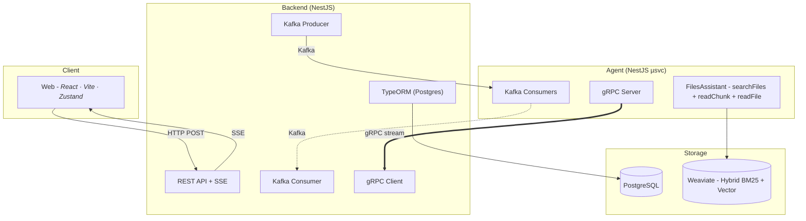
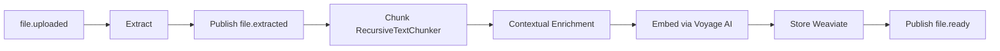
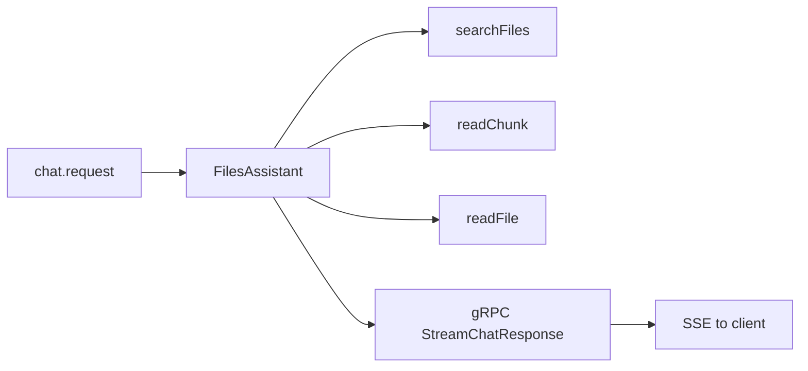

# Files Assistant

AI-powered files assistant with hybrid search (BM25 + vector) and Q&A over uploaded documents. Upload files (PDF, plain text, markdown, JSON), the system runs **extract → chunk → embed (Voyage AI) → store in Weaviate**, then a single VoltAgent answers questions using **`searchFiles`** (hybrid), **`readChunk`** (exact chunk retrieval), and **`readFile`** (document-level reading) tools.

## Architecture

Two independent services communicating through Redpanda (Kafka):

- **Backend** (`apps/backend`) -- NestJS CRUD API, Multer uploads, Swagger docs, SSE streaming
- **Agent** (`apps/agent`) -- VoltAgent single chat agent + Kafka consumers (ingestion + chat)
- **Agent Dev** (`apps/agent-dev`) -- Standalone VoltAgent dev server with VoltOps dashboard

Shared libraries:

- `libs/core` -- Pure TypeScript: ports, types, extraction, chunking
- `libs/events` -- Kafka event schemas (shared between services)
- `libs/weaviate` -- Weaviate client wrapper and collection schemas

## Prerequisites

- Node.js 22+
- pnpm 10+
- Docker & Docker Compose

## Quick Start

```bash
# Install dependencies
pnpm install

# Start infrastructure (PostgreSQL, Weaviate, Redpanda)
docker compose up -d

# Copy environment variables
cp .env.example .env
# Edit .env with your ANTHROPIC_API_KEY, VOYAGE_API_KEY (and optional model overrides)

# Start backend API (:3000)
pnpm exec nx serve backend

# Start agent service (Kafka consumer)
pnpm exec nx serve agent

# Start agent dev server with VoltOps dashboard (:3141)
pnpm exec nx serve agent-dev
```

## Development Commands

```bash
# Serve
pnpm exec nx serve backend              # NestJS API (:3000)
pnpm exec nx serve agent                # Kafka consumer agent
pnpm exec nx serve agent-dev            # VoltAgent + VoltOps (:3141)

# Build
pnpm exec nx build backend --configuration=production
pnpm exec nx build agent --configuration=production

# Test
pnpm exec nx test core                  # libs unit tests
pnpm exec nx test events                # event schema tests
pnpm exec nx test backend               # backend tests
pnpm exec nx test agent                 # agent tests

# Affected (CI)
pnpm exec nx affected -t lint,test,build

# Dependency graph
pnpm exec nx graph
```

## API Documentation

When the backend is running, Swagger UI is available at:

```
http://localhost:3000/api/docs
```

### Endpoints

| Method   | Path                    | Description                        |
|----------|-------------------------|------------------------------------|
| `POST`   | `/api/files/upload`     | Upload a file for processing       |
| `GET`    | `/api/files`            | List files (paginated)             |
| `GET`    | `/api/files/:id`        | File details + status              |
| `DELETE` | `/api/files/:id`        | Delete file + Weaviate chunks      |
| `GET`    | `/api/files/:id/events` | SSE: processing status             |
| `POST`   | `/api/chat`             | Send chat message                  |
| `GET`    | `/api/chat/stream/:id`  | SSE: stream response tokens        |
| `GET`    | `/api/chat/history`     | Conversation history               |
| `GET`    | `/api/health`           | Liveness probe                     |
| `GET`    | `/api/ready`            | Readiness probe                    |

## Infrastructure

```bash
docker compose up -d     # Start all services
docker compose down      # Stop all services
docker compose logs -f   # View logs
```

| Service           | Port  | Dashboard            |
|-------------------|-------|----------------------|
| PostgreSQL        | 5432  | --                   |
| Weaviate          | 8080  | --                   |
| Redpanda (Kafka)  | 19092 | --                   |
| Redpanda Console  | 8888  | http://localhost:8888|

## Project Structure

```
files-assistant/
  apps/
    backend/          NestJS CRUD API + Kafka producer
    agent/            VoltAgent agent + Kafka consumers
    agent-dev/        VoltAgent standalone dev server
  libs/
    core/             Pure TS: ports, types, extraction, chunking
    events/           Kafka event schemas
    weaviate/         Weaviate client wrapper
```

## Tech Stack

| Layer              | Technology                                       |
|--------------------|--------------------------------------------------|
| Monorepo           | Nx 22, pnpm, TypeScript 5.9                      |
| Backend            | NestJS 11, TypeORM, Swagger, Multer              |
| Agent              | VoltAgent, @ai-sdk/anthropic, Zod                |
| Search index       | Weaviate (`FileChunks`, HNSW cosine vectors + BM25; hybrid search) |
| Embeddings         | Voyage AI (`voyage-3-lite`, 1024 dims) via `voyageai` SDK |
| Relational DB      | PostgreSQL 16                                    |
| LLM                | Anthropic Claude via `@ai-sdk/anthropic` (`ANTHROPIC_MODEL`, `ANTHROPIC_HAIKU_MODEL`) |
| Event Streaming    | Redpanda (Kafka-compatible)                      |
| RPC Streaming      | gRPC (protobuf `ChatStream` service)             |
| File Storage       | Local disk or S3 (configurable via `STORAGE_TYPE`) |

---

## System Design

### High-Level Architecture



### Service Responsibilities

| Service | Owns | Communicates via |
|---------|------|------------------|
| **Web** | UI, file uploads, chat interface, SSE subscriptions | HTTP → Backend |
| **Backend** | REST API, file metadata (Postgres), SSE streaming, Kafka fan-in/out, gRPC forwarding | HTTP, SSE, Kafka, gRPC |
| **Agent** | Ingestion (extract → chunk → embed → store), chat (hybrid search + exact chunk read + document read), streaming responses | Kafka, gRPC, Weaviate, Voyage AI |

### Transport Architecture

The system uses three transport layers with clearly separated concerns:

| Transport | Direction | Purpose |
|-----------|-----------|---------|
| **Kafka (Redpanda)** | Backend ↔ Agent | Durable async task dispatch (`file.uploaded`, `chat.request`) and status notifications (`file.ready`, `file.failed`, `file.extracted`) |
| **gRPC** | Agent → Backend | Real-time streaming of chat response tokens via `ChatStream.StreamChatResponse` |
| **SSE** | Backend → Web | Browser-compatible push for file processing events and chat response chunks |

**Why the split:** Kafka provides durability, retry semantics, and consumer-group scaling for work that doesn't need instant delivery. gRPC provides streaming with backpressure for response tokens where latency matters. SSE bridges gRPC to the browser, which cannot consume gRPC directly.

### Data Storage

| Store | Contents | Access Pattern |
|-------|----------|----------------|
| **PostgreSQL** | File metadata, chunk records, conversations, messages | TypeORM entities, migrations on startup |
| **Weaviate** | Text chunks + vectors (`FileChunks`, HNSW cosine) | Hybrid search (BM25 + vector), alpha-tunable |
| **Local/S3** | Raw uploaded files | Configurable via `STORAGE_TYPE` env; path stored in Postgres file record |

### Kafka Topics & Consumer Groups

| Topic | Producer | Consumer | Purpose |
|-------|----------|----------|---------|
| `file.uploaded` | Backend | Agent (`agent-workers`) | Trigger ingestion pipeline |
| `file.extracted` | Agent | Backend (`backend-notifications`) | Persist extracted text |
| `file.ready` | Agent | Backend (`backend-notifications`) | Mark file as searchable |
| `file.failed` | Agent | Backend (`backend-notifications`) | Record processing failure |
| `chat.request` | Backend | Agent (`agent-workers`) | Trigger chat response |
| `dlq.file.uploaded` | Agent | — (ops monitoring) | Poison message quarantine |
| `dlq.chat.request` | Agent | — (ops monitoring) | Poison message quarantine |

### Shared Libraries

| Library | Purpose | Key Exports |
|---------|---------|-------------|
| `libs/core` | Framework-agnostic types, ports, extractors, chunking, contextual enrichment | `SearchPort`, `StoragePort`, `EmbeddingPort`, `RecursiveTextChunker`, `buildContextualTexts`, `AgentProcessingError` |
| `libs/events` | Kafka event contracts shared between services | `TOPICS`, `CONSUMER_GROUPS`, `DLQ_TOPICS`, Zod schemas, event factories |
| `libs/weaviate` | Weaviate collection schema and client helpers | `FILE_CHUNKS_COLLECTION`, `ensureFileChunksCollection` |
| `libs/proto` | gRPC service definition | `chat-stream.proto` — `ChatStream.StreamChatResponse` |

### Error Handling & Degradation

Chat errors surface through the gRPC/SSE path; ingestion failures are published as `file.failed` with a **stage** (`extraction`, `chunking`, or `embedding`). The `embedding` stage covers both Voyage API failures and Weaviate storage failures. Poison messages are routed to dead-letter queues.

### Migration (schema change)

The Weaviate `FileChunks` collection uses HNSW with cosine distance for vector search. If you change the schema (e.g. vector dimensions, distance metric), **reset the collection** before ingesting again: call `resetFileChunksCollection` from `libs/weaviate` against your cluster, or remove the Weaviate Docker volume and let the stack recreate an empty store.

---

## Scenario — Test Coverage

### Testing Stack

| Layer | Framework | Runner |
|-------|-----------|--------|
| Unit tests | Jest + ts-jest | `pnpm exec nx test <project>` |
| Integration / E2E | Jest + supertest + Docker Compose | `pnpm exec nx e2e backend-e2e` |
| Test environment | `jest.preset.js` extends `@nx/jest/preset` | Node environment, per-project configs |

### Unit Tests — Agent (`apps/agent`)

**`ingestion.consumer.spec.ts`** — IngestionConsumer pipeline

| Scenario | Asserts |
|----------|---------|
| Full PDF pipeline | extract → `file.extracted` → chunk → embed → store → `file.ready` (`vectorsStored > 0`) |
| TXT pipeline | `extractionMethod: 'raw'`, correct text passthrough |
| Extraction error | `file.failed` with `stage: 'extraction'` |
| Zero chunks produced | `file.failed` with `stage: 'chunking'`, no `storeChunks` call |
| Embedding error | `file.failed` with `stage: 'embedding'` (Voyage API failure) |
| Storage error | `file.failed` with `stage: 'embedding'` (Weaviate storage failure) |
| Event ordering | `file.extracted` published before `storeChunks` |
| Generic errors | Non-`AgentProcessingError` → `file.failed` with `stage: 'extraction'` |
| Event payload fields | `file.extracted` and `file.ready` carry correct metadata |

Mocks: `extractTextTool.execute`, `KafkaEventAdapter` methods, `STORAGE_PORT`, `EMBEDDING_PORT`.

**`kafka-event.adapter.spec.ts`** — KafkaEventAdapter

| Scenario | Asserts |
|----------|---------|
| Correct topic | Sends to `file.extracted` |
| Message key | Uses `fileId` as partition key |
| Payload shape | JSON value includes all event fields |
| Timestamp | Auto-generated ISO timestamp within acceptable range |

Mocks: `kafkajs` Kafka constructor, `ConfigService`.

**`extract-text.tool.spec.ts`** — extractTextTool

| Scenario | Asserts |
|----------|---------|
| MIME routing | PDF → Anthropic Haiku; `text/plain`, `text/markdown`, `application/json` → raw read |
| PDF extraction | Correct document block shape, base64 encoding, prompt text |
| Raw extraction | UTF-8 preservation, correct `method` and `characterCount` |
| Empty Haiku response | Throws `AgentProcessingError` |
| Rate limit (429) | Throws retryable `AgentProcessingError` |
| File not found (ENOENT) | Throws non-retryable `AgentProcessingError` |
| Model env var | Respects `ANTHROPIC_HAIKU_MODEL` |

Mocks: `node:fs/promises`, injectable Anthropic client.

### Unit Tests — Backend (`apps/backend`)

**`files.service.spec.ts`** — FilesService

| Scenario | Asserts |
|----------|---------|
| Status updates | DB write for `EXTRACTING`, `EXTRACTED`, `EMBEDDING` |
| SSE intermediate events | Stream emits on non-terminal statuses, does not complete |
| SSE terminal `READY` | Stream emits and completes |
| SSE terminal `FAILED` | Stream emits error payload and completes |
| Full status progression | `PROCESSING` → `EXTRACTING` → `EXTRACTED` → `EMBEDDING` → `READY` emits 4 SSE events |
| Invalid transition | Warns via logger, still persists update |
| Filtered queries | `findAll` with `status=extracted` applies `andWhere` filter |

Mocks: TypeORM repositories (`FileEntity`, `ChunkEntity`), `KafkaProducerService`, `Logger.prototype.warn`.

### Unit Tests — Libraries

**`libs/events` — `file-extracted.event.spec.ts`**

| Scenario | Asserts |
|----------|---------|
| Topic constant | `TOPICS.FILE_EXTRACTED === 'file.extracted'` |
| Factory timestamp | `createFileExtractedEvent` sets valid ISO timestamp |
| Field passthrough | Factory preserves all input fields |
| Optional fields | `pageCount` present/absent handled correctly |

### E2E Tests (`apps/backend-e2e`)

Full integration tests against a real stack (Docker Compose with Postgres + Redpanda, mocked Anthropic + storage).

**`ingestion-happy-path.e2e-spec.ts`**

| Scenario | Asserts |
|----------|---------|
| PDF upload | Status `ready`, extraction method `haiku`, `parsedText` matches mock, `chunkCount > 0` |
| TXT upload | Status `ready`, extraction method `raw`, text matches fixture |
| MD upload | Status `ready`, markdown content preserved (headings, lists) |
| JSON upload | Status `ready`, `parsedText` parses as valid JSON |

**`ingestion-failure.e2e-spec.ts`**

| Scenario | Asserts |
|----------|---------|
| Corrupt PDF | Status `failed`, `errorStage: 'extraction'` |
| Embedding error | Status `failed`, `errorStage: 'embedding'`, DB has `parsedText` and `extractionMethod: 'raw'` |
| Empty file | Status `failed` |

**`ingestion-sse.e2e-spec.ts`**

| Scenario | Asserts |
|----------|---------|
| Successful upload | SSE statuses include `extracted` before `ready` |
| Stream closes after ready | SSE connection terminates after terminal event |
| Corrupt PDF failure | SSE closes after `failed` with error payload |

**`ingestion-kafka-events.e2e-spec.ts`**

| Scenario | Asserts |
|----------|---------|
| PDF event sequence | Topics `file.uploaded` → `file.extracted` → `file.ready` in order |
| Corrupt PDF events | `file.uploaded` + `file.failed` (stage `extraction`), no extracted/ready |
| TXT + embedding fail | `file.uploaded`, `file.extracted`, `file.failed` (stage `embedding`), no ready |

**`ingestion-rejection.e2e-spec.ts`**

| Scenario | Asserts |
|----------|---------|
| DOCX upload | 400 with unsupported type message |
| MP4 upload | 400 rejected |
| CSV upload | 400 rejected |
| XLSX upload | 400 rejected |
| EXE upload | 400 rejected |
| No file attached | 400 rejected |

### Coverage Gaps

| Area | Status |
|------|--------|
| `libs/core` (chunker, extractors, types) | Jest config present, **no spec files** |
| `libs/weaviate` (collection helpers) | Jest config present, **no spec files** |
| `apps/web` (React frontend) | **No test files** |
| Chat pipeline (E2E) | Not covered in E2E suite |
| WeaviateAdapter (BM25 search) | No dedicated unit tests |

---

## AI Pipeline

### Overview

Two flows: **Ingestion** (Kafka `file.uploaded` → extract → chunk → embed via Voyage → store in Weaviate) and **Chat** (Kafka `chat.request` → single **FilesAssistant** agent with hybrid search tools).

### Models

| Role | Env variable | Default (code) | Used for |
|------|--------------|----------------|----------|
| Chat | `ANTHROPIC_MODEL` | `claude-sonnet-4-20250514` | Main agent (`searchFiles`, `readChunk`, `readFile`) |
| PDF extraction | `ANTHROPIC_HAIKU_MODEL` | `claude-haiku-4-5-20251001` | PDF → text via Anthropic Messages + `document` block |
| Embeddings | `VOYAGE_MODEL` | `voyage-3-lite` | Contextual chunk embeddings (1024 dims) + query embeddings via Voyage AI |

### Ingestion pipeline

Triggered by `file.uploaded`. Implemented in `IngestionConsumer` (not LLM-orchestrated).



| Step | Behavior |
|------|----------|
| Extract | PDF via Haiku + `document` block; plain text / MD / JSON via `fs.readFile`. |
| Chunk | Heuristic `RecursiveTextChunker` (size/overlap constants in consumer). |
| Contextual Enrichment | `buildContextualTexts` prepends file name + nearest section heading to each chunk for embedding input only. |
| Embed | `VoyageEmbeddingAdapter.embedDocuments` — batch embed enriched texts via Voyage AI (`input_type: 'document'`). |
| Store | `WeaviateStorageAdapter.storeChunks` — text properties + vectors in HNSW index. |

`file.ready` includes `chunksCreated` and `vectorsStored`.

### Chat pipeline (RAG)

Triggered by `chat.request`. One **Agent** (`FilesAssistant`) runs with:

| Tool | Purpose |
|------|---------|
| `searchFiles` | Hybrid search (BM25 + vector) over Weaviate `FileChunks` (tenant-scoped; optional file scope; alpha-tunable via `HYBRID_ALPHA`). Returns model-friendly truncated text while preserving full chunk metadata for sources. |
| `readChunk` | Exact single-chunk retrieval by `fileId` + `chunkIndex` + `tenantId` for citation-fidelity and authoritative preview text. |
| `readFile` | Document-level read via stored chunks (`getFileChunks`), capped by `MAX_FILE_CONTENT_CHARS` and sampled for large files. |



Response tokens stream over gRPC to the Backend, then SSE to the browser. History is persisted in Postgres when the stream completes.

### Weaviate collection schema (`FileChunks`)

| Property | Type | Description |
|----------|------|-------------|
| `content` | text | Chunk text (BM25 indexed) |
| `fileId` | text | Source file id |
| `fileName` | text | Original file name |
| `chunkIndex` | int | Order within file |
| `tenantId` | text | Tenant isolation |
| `startOffset` | int | Start offset in source text |
| `endOffset` | int | End offset in source text |

Vectorizer: `none` (BYO vectors via Voyage AI). Vector index: HNSW with cosine distance. Hybrid search blends BM25 keyword scores with vector similarity using a configurable `alpha` parameter (default `0.75` = 75% vector, 25% BM25).
