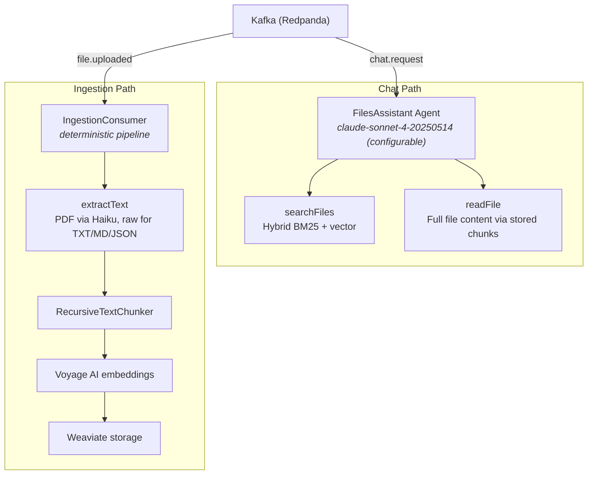
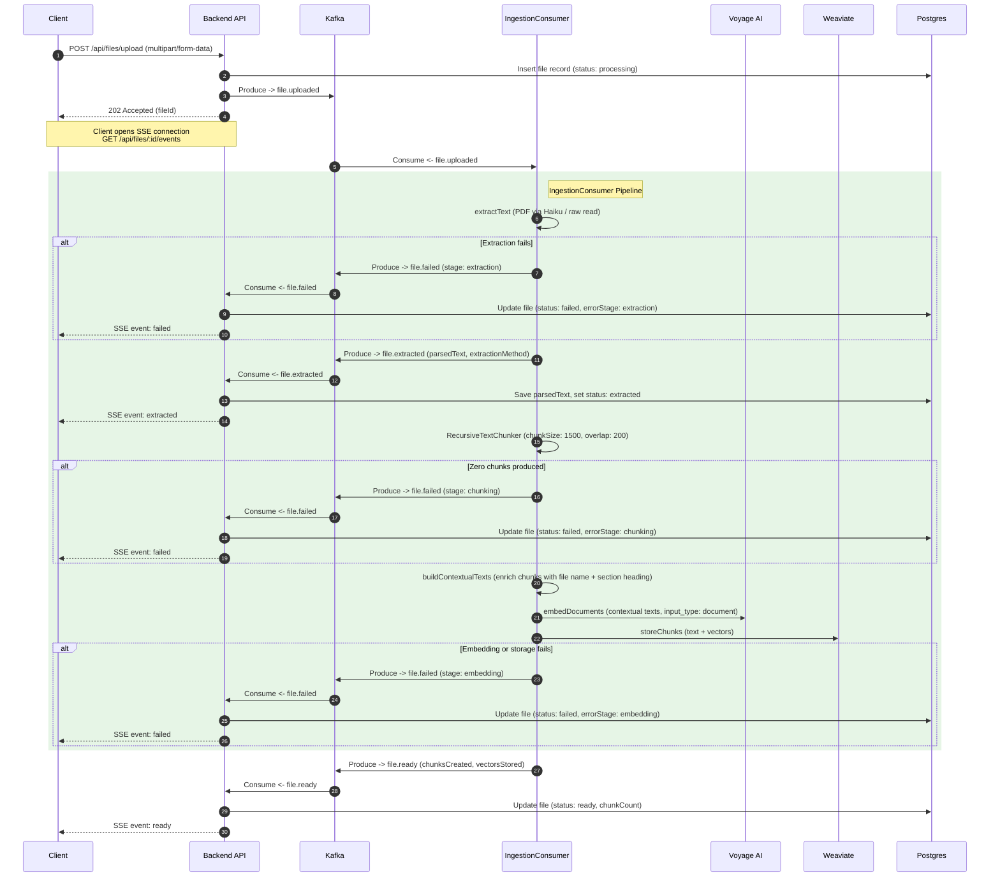
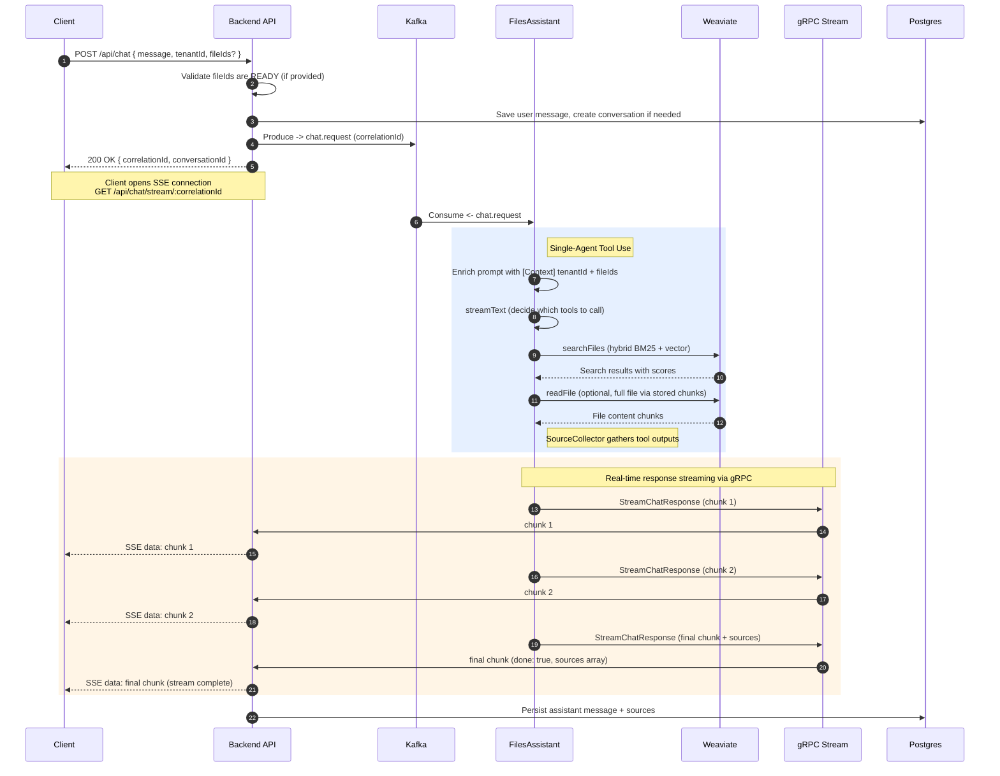
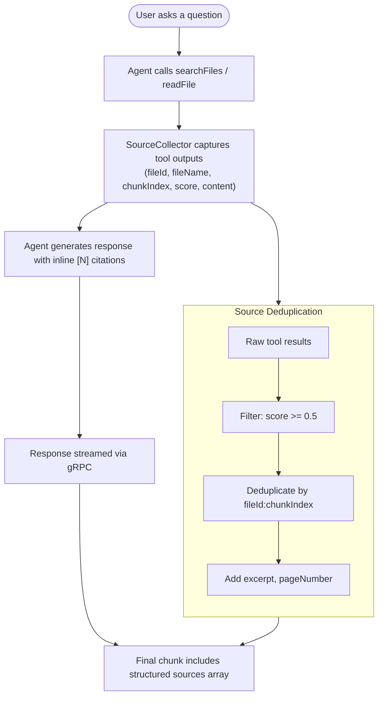
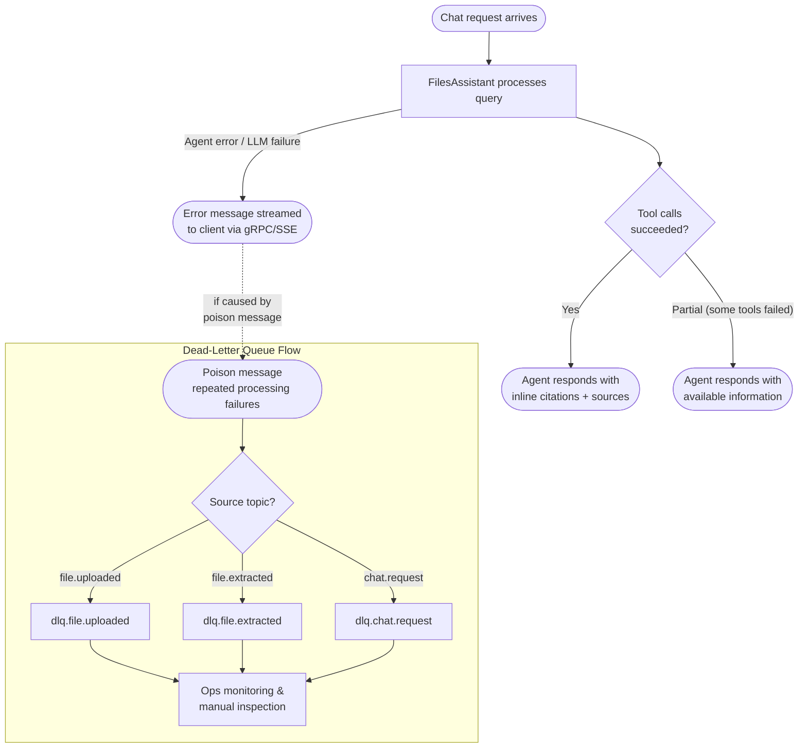
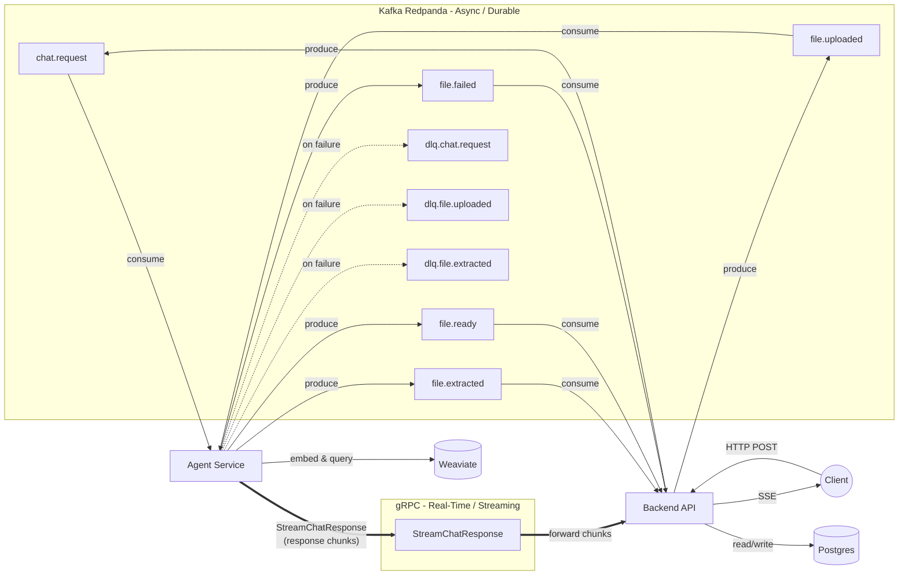

# Files Assistant — System Scenarios & Architecture Diagrams

This document provides a visual reference for the files-assistant system. Each section contains a Mermaid diagram illustrating a key aspect of the architecture, along with explanatory context.

---

## Table of Contents

1. [Agent Architecture](#1-agent-architecture)
2. [Ingestion Flow](#2-ingestion-flow)
3. [Chat + gRPC Streaming Flow](#3-chat--grpc-streaming-flow)
4. [Inline Citation & Source Collection](#4-inline-citation--source-collection)
5. [Error and Degradation Flows](#5-error-and-degradation-flows)
6. [Transport Architecture](#6-transport-architecture)

---

## 1. Agent Architecture

The system has two distinct runtime paths — **chat** and **ingestion** — with clearly separated responsibilities.

**Chat** is handled by a single VoltAgent **FilesAssistant** agent backed by Anthropic Claude. It decides which tools to call based on the user's message and its system instructions.

**Ingestion** is a deterministic pipeline in `IngestionConsumer` (no LLM orchestration). It runs extract → chunk → embed → store sequentially when a `file.uploaded` Kafka event arrives.

**Key points:**

- The FilesAssistant agent uses `streamText` to produce response tokens streamed over gRPC.
- Ingestion does not involve the LLM agent — it is a Kafka consumer running a fixed pipeline.
- PDF extraction uses Anthropic Haiku via the `document` block API; plain text/markdown/JSON are read raw.
- The chat model is configurable via `ANTHROPIC_MODEL` env var (default `claude-sonnet-4-20250514`).

---

## 2. Ingestion Flow

When a user uploads a file, the system processes it asynchronously through Kafka and the `IngestionConsumer` pipeline. The client receives real-time status updates via SSE.

**Key points:**

- The backend returns `202 Accepted` immediately — all heavy processing is async.
- `file.extracted` is published after text extraction and before chunking, so the backend can persist parsed text early.
- Three distinct failure stages (`extraction`, `chunking`, `embedding`) are conveyed via the `stage` field on `file.failed`.
- The `embedding` stage covers both Voyage AI API failures and Weaviate storage failures.
- Contextual enrichment prepends file name and nearest section heading to each chunk before embedding (embedding input only — stored text is unchanged).
- Weaviate stores the vector-embedded chunks; Postgres tracks file metadata and status.

---

## 3. Chat + gRPC Streaming Flow

Chat requests are initiated over HTTP/Kafka but responses stream back in real-time through gRPC. This hybrid transport design separates the fire-and-forget request path from the latency-sensitive response path.

**Key points:**

- **Kafka** carries the initial `chat.request` (async, durable, retryable).
- **gRPC `StreamChatResponse`** carries the response chunks (real-time, low-latency). The final chunk includes a `sources` array with file references and relevance scores.
- The backend bridges gRPC chunks into SSE events for the browser client.
- SSE includes a **heartbeat** every 15 seconds and a **120-second timeout**. A `POST /api/chat/cancel/:correlationId` endpoint allows explicit stream cancellation.
- Conversation history (user message + assistant response + sources) is persisted to Postgres after streaming completes.
- The backend validates that all requested `fileIds` are in `READY` status before publishing `chat.request`.

---

## 4. Inline Citation & Source Collection

The FilesAssistant agent produces inline citations as part of its natural response generation, guided by system instructions. There is no separate citation sub-agent or post-processing loop.

**How it works:**

1. The agent's system instructions direct it to add `[N]` citation markers after claims that draw on tool results.
2. A `SourceCollector` hooks into `onToolEnd` — it captures search results from `searchFiles` and chunk data from `readFile`.
3. After streaming completes, collected sources are deduplicated (by `fileId:chunkIndex`), filtered (minimum score `0.5`), and attached to the final gRPC chunk as a structured `sources` array.
4. The frontend renders source details automatically from this structured metadata — the agent does not produce a references section.

**Citation rules (from agent instructions):**

- Number citations starting from 1 in the order that distinct source chunks first appear.
- Place `[N]` immediately after the claim or quote it supports.
- If multiple results from the same file and chunk support a claim, use the same `[N]`.
- Never invent citations — if no sources are available, respond without markers.

---

## 5. Error and Degradation Flows

The system is designed to degrade gracefully. Chat errors are surfaced through the gRPC/SSE path. Ingestion failures are published as `file.failed` with a specific `stage`. Poison messages are routed to dead-letter queues.

**Chat degradation:**

| Tier | Response Type | Condition |
|------|--------------|-----------|
| 1 | Cited response with sources | Tool calls succeed, sources collected |
| 2 | Partial response | Some tools fail, agent responds with available info |
| 3 | Error message | Agent pipeline fails entirely (LLM error, timeout) |

**Ingestion degradation:**

| Stage | Failure | Result |
|-------|---------|--------|
| `extraction` | PDF Haiku error, file not found, unsupported MIME | `file.failed` with `stage: extraction` |
| `chunking` | Zero chunks produced from extracted text | `file.failed` with `stage: chunking` |
| `embedding` | Voyage API failure or Weaviate storage error | `file.failed` with `stage: embedding` |

**DLQ topics:**

- `dlq.file.uploaded` — failed file ingestion messages
- `dlq.file.extracted` — failed extracted text processing
- `dlq.chat.request` — failed chat processing messages

---

## 6. Transport Architecture

The system uses three transport layers with clearly separated responsibilities. Kafka handles durable, async event processing. gRPC handles real-time, low-latency response streaming. SSE bridges gRPC to the browser.

**Transport responsibilities:**

| Transport | Direction | Topics / RPCs | Purpose |
|-----------|-----------|--------------|---------|
| **Kafka** | Backend -> Agent | `chat.request`, `file.uploaded` | Durable task dispatch |
| **Kafka** | Agent -> Backend | `file.extracted`, `file.ready`, `file.failed` | Async status notifications |
| **Kafka** | Agent -> DLQ | `dlq.chat.request`, `dlq.file.uploaded`, `dlq.file.extracted` | Poison message quarantine |
| **gRPC** | Agent -> Backend | `ChatStream.StreamChatResponse` | Real-time response streaming |
| **SSE** | Backend -> Client | (HTTP event stream) | Browser-compatible push |

**Kafka consumer groups:**

| Group | Service | Subscribes to |
|-------|---------|---------------|
| `agent-ingestion` | Agent | `file.uploaded` |
| `agent-chat` | Agent | `chat.request` |
| `backend-notifications` | Backend | `file.ready`, `file.failed`, `file.extracted` |

**Why the split?**

- **Kafka** provides durability, retry semantics, and consumer-group scaling for work that doesn't need instant delivery.
- **gRPC** provides client-streaming with backpressure for response chunks where latency matters.
- **SSE** bridges gRPC to the browser, which cannot consume gRPC directly.

---

## Infrastructure Summary

| Component | Role | Persistence |
|-----------|------|-------------|
| **Postgres** | File metadata, conversations, chat history | Durable (relational) |
| **Weaviate** | Vector-embedded document chunks (HNSW + BM25) | Durable (vector) |
| **Redpanda** | Kafka-compatible event broker | Durable (log) |
| **Backend API** | HTTP/SSE gateway, Kafka producer/consumer, gRPC client | Stateless |
| **Agent Service** | FilesAssistant agent + IngestionConsumer, Kafka consumer, gRPC server | Stateless |
