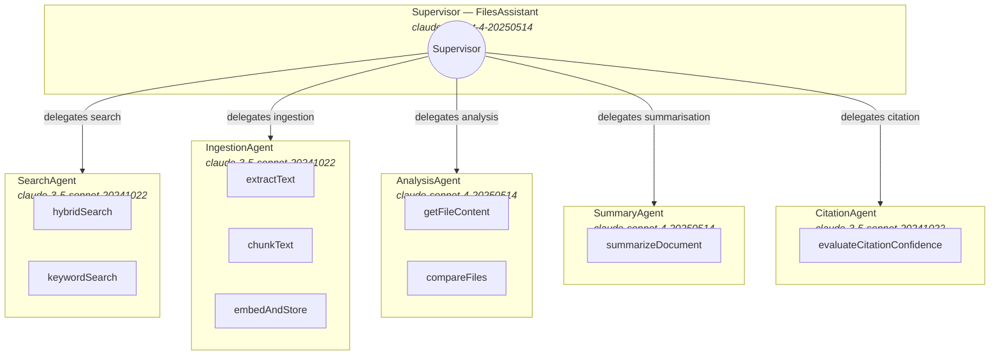
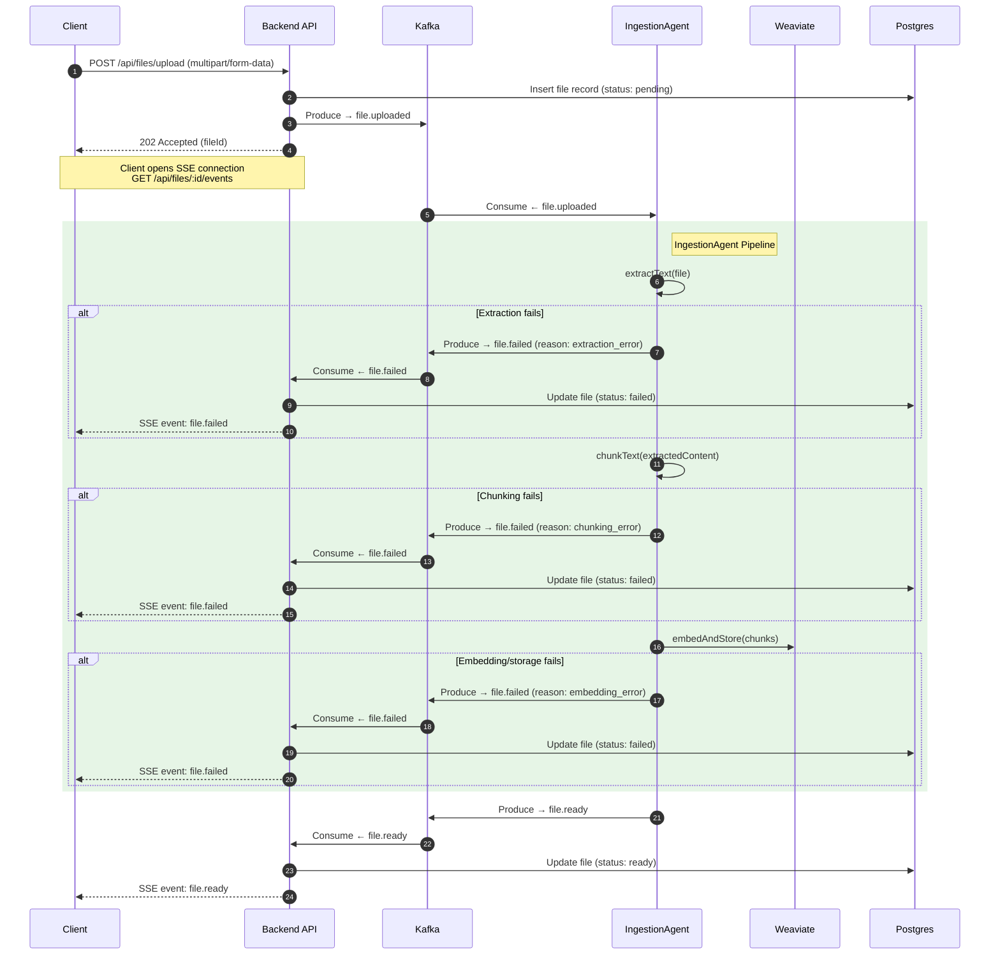
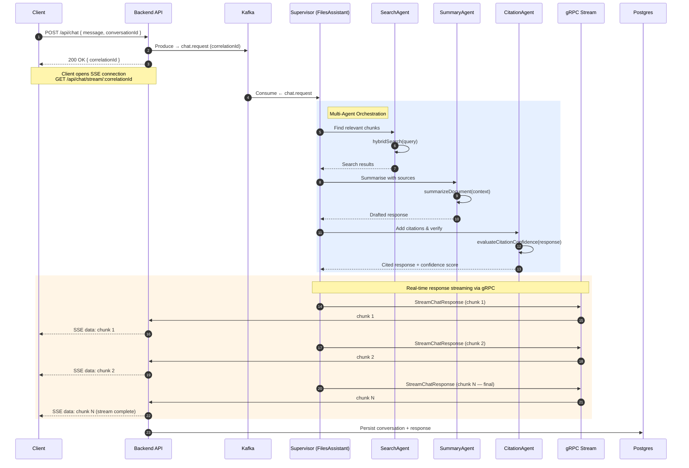
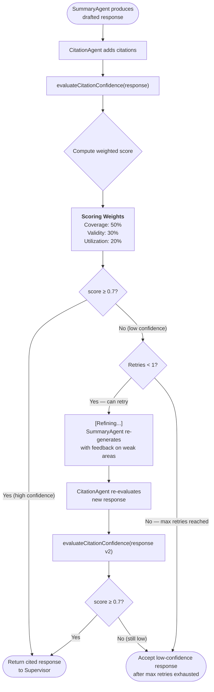
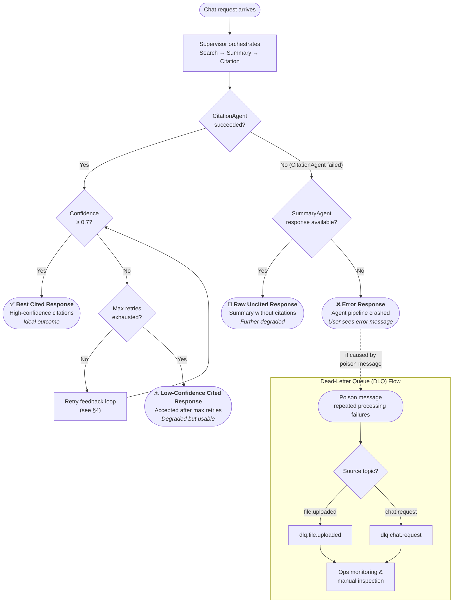
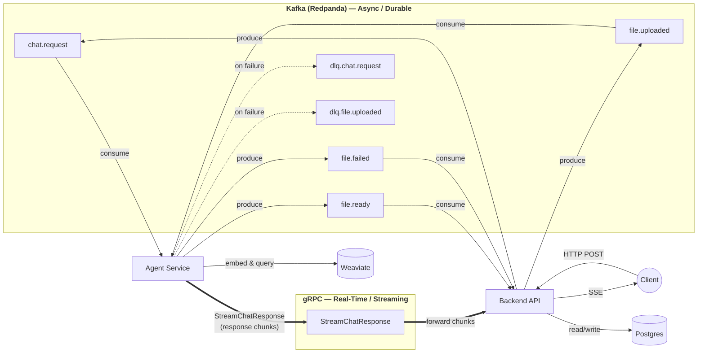

# Files Assistant — System Scenarios & Architecture Diagrams

This document provides a visual reference for the files-assistant multi-agent system. Each section contains a Mermaid diagram illustrating a key aspect of the architecture, along with explanatory context.

---

## Table of Contents

1. [Multi-Agent Architecture](#1-multi-agent-architecture)
2. [Ingestion Flow](#2-ingestion-flow)
3. [Chat + gRPC Streaming Flow](#3-chat--grpc-streaming-flow)
4. [Citation Confidence Feedback Loop](#4-citation-confidence-feedback-loop)
5. [Error and Degradation Flows](#5-error-and-degradation-flows)
6. [Transport Architecture](#6-transport-architecture)

---

## 1. Multi-Agent Architecture

The system is orchestrated by a **Supervisor** (FilesAssistant) that delegates work to five specialised sub-agents. Each agent is backed by a specific Claude model and exposes purpose-built tools.

**Key points:**

- The Supervisor never calls tools directly — it routes tasks to the appropriate sub-agent.
- `claude-sonnet-4-20250514` is used where complex reasoning is needed (Supervisor, Analysis, Summary).
- `claude-3-5-sonnet-20241022` handles high-throughput or more mechanical tasks (Search, Ingestion, Citation).

---

## 2. Ingestion Flow

When a user uploads a file, the system processes it asynchronously through Kafka and the IngestionAgent pipeline. The client receives real-time status updates via SSE.

**Key points:**

- The backend returns `202 Accepted` immediately — all heavy processing is async.
- Three distinct failure points (extraction, chunking, embedding) each produce a `file.failed` event with a specific reason.
- Weaviate stores the vector-embedded chunks; Postgres tracks file metadata and status.

---

## 3. Chat + gRPC Streaming Flow

Chat requests are initiated over HTTP/Kafka but responses stream back in real-time through gRPC. This hybrid transport design separates the fire-and-forget request path from the latency-sensitive response path.

**Key points:**

- **Kafka** carries the initial `chat.request` (async, durable, retryable).
- **gRPC `StreamChatResponse`** carries the response chunks (real-time, low-latency).
- The backend bridges gRPC chunks into SSE events for the browser client.
- Conversation history is persisted to Postgres after streaming completes.

---

## 4. Citation Confidence Feedback Loop

The CitationAgent scores every response using a weighted confidence formula. If the score falls below the threshold, the system retries through a feedback loop between the SummaryAgent and CitationAgent.

**Key points:**

- **Coverage (50%)** — Are all claims backed by source material?
- **Validity (30%)** — Are the cited sources genuine and correctly referenced?
- **Utilization (20%)** — Are the available sources being used effectively?
- The threshold is **0.7**. Responses scoring below this trigger a re-generation loop.
- **Max retries = 1** — the system makes at most one refinement attempt before accepting whatever score it has.

---

## 5. Error and Degradation Flows

The system is designed to degrade gracefully. Rather than returning an error to the user when a single component fails, it falls through a chain of progressively less ideal response types. Poison messages are routed to dead-letter queues.

**Degradation chain (best to worst):**

| Tier | Response Type | Condition |
|------|--------------|-----------|
| 1 | Best cited response | Confidence ≥ 0.7 on first or retry pass |
| 2 | Low-confidence cited response | Confidence < 0.7 after max retries (1) exhausted |
| 3 | Raw uncited response | CitationAgent failed but SummaryAgent output exists |
| 4 | Error response | Agent pipeline crashed entirely |

**DLQ topics:**

- `dlq.file.uploaded` — failed file ingestion messages
- `dlq.chat.request` — failed chat processing messages

---

## 6. Transport Architecture

The system uses two transport mechanisms with clearly separated responsibilities. Kafka handles durable, async event processing. gRPC handles real-time, low-latency response streaming.

**Transport responsibilities:**

| Transport | Direction | Topics / RPCs | Purpose |
|-----------|-----------|--------------|---------|
| **Kafka** | Backend → Agent | `chat.request`, `file.uploaded` | Durable task dispatch |
| **Kafka** | Agent → Backend | `file.ready`, `file.failed` | Async status notifications |
| **Kafka** | Agent → DLQ | `dlq.chat.request`, `dlq.file.uploaded` | Poison message quarantine |
| **gRPC** | Agent → Backend | `StreamChatResponse` | Real-time response streaming |
| **SSE** | Backend → Client | (HTTP event stream) | Browser-compatible push |

**Why the split?**

- **Kafka** provides durability, retry semantics, and consumer-group scaling for work that doesn't need instant delivery.
- **gRPC** provides bidirectional streaming with backpressure for response chunks where latency matters.
- **SSE** bridges gRPC to the browser, which cannot consume gRPC directly.

---

## Infrastructure Summary

| Component | Role | Persistence |
|-----------|------|-------------|
| **Postgres** | File metadata, conversations, chat history | Durable (relational) |
| **Weaviate** | Vector-embedded document chunks | Durable (vector) |
| **Redpanda** | Kafka-compatible event broker | Durable (log) |
| **Backend API** | HTTP/SSE gateway, Kafka producer/consumer, gRPC client | Stateless |
| **Agent Service** | Multi-agent orchestration, Kafka consumer, gRPC server | Stateless |
