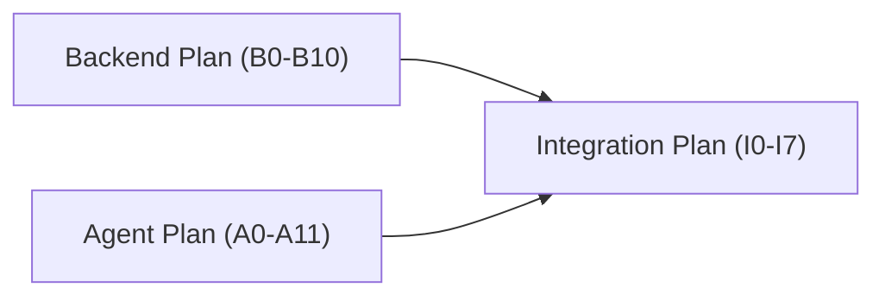
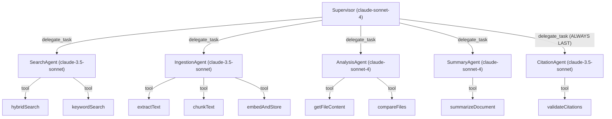

# AI Files Assistant -- Complete Implementation Plan

## Overview

Complete implementation plan for the AI Files Assistant: validated multi-agent architecture with Anthropic-only models, Voyage AI embeddings, CitationAgent design, end-to-end ingestion and chat workflows, comprehensive error handling, and SSE streaming.

---

## Execution Plans (Parallelizable)

This architecture plan is split into 3 isolated, executable plans. The Backend and Agent plans can run in parallel by separate sub-agents. The Integration plan runs last.

| Plan | File | Scope | Depends On |
|------|------|-------|------------|
| **Backend** | [backend_plan.md](backend_plan.md) | `apps/backend`, `libs/proto`, `libs/events` | -- |
| **Agent** | [agent_plan.md](agent_plan.md) | `apps/agent`, `apps/agent-dev`, `libs/core`, `libs/weaviate` | -- |
| **Integration** | [integration_plan.md](integration_plan.md) | Cross-service verification, E2E testing, `docs/scenarios.md` | Backend + Agent |



Shared lib ownership (no conflicts when run in parallel):
- Backend plan owns: `libs/proto/`, `libs/events/` changes
- Agent plan owns: `libs/core/src/errors/`, `libs/weaviate/` changes

---

## 1. Model Strategy (Anthropic-Only, No OpenAI)

All LLM work uses Anthropic models via `@ai-sdk/anthropic`. Vector embeddings use Voyage AI (Anthropic's recommended embedding partner). Remove `@ai-sdk/openai` from dependencies.

| Agent | Model | Rationale |
|-------|-------|-----------|
| **Supervisor** | `claude-sonnet-4-20250514` | Routing decisions need strong reasoning |
| **IngestionAgent** | `claude-3-5-sonnet-20241022` | Lighter model for orchestrating extract/chunk/embed |
| **SearchAgent** | `claude-3-5-sonnet-20241022` | Lightweight search orchestration |
| **SummaryAgent** | `claude-sonnet-4-20250514` | Summarization needs strong comprehension |
| **AnalysisAgent** | `claude-sonnet-4-20250514` | Deep analysis needs strong reasoning |
| **CitationAgent** (NEW) | `claude-3-5-sonnet-20241022` | Structured citation formatting |
| **Embeddings** | `voyage-4-lite` via `voyageai` npm | Dedicated embedding model (no Anthropic embedding model exists) |

All model IDs are configured via environment variables (`ANTHROPIC_INGESTION_MODEL`, `ANTHROPIC_SUMMARY_MODEL`, etc.) so they can be swapped without code changes. Add `VOYAGE_API_KEY` to `.env.example`.

---

## 2. Updated Multi-Agent Architecture

Add a **CitationAgent** as the 5th sub-agent. The supervisor's guidelines enforce that CitationAgent is always the **last** agent in the chat/summarization chain.



Key supervisor guideline additions:

- "After ANY response that uses file content (search, summary, analysis, comparison), ALWAYS delegate to CitationAgent as the FINAL step"
- "For ingestion tasks, delegate ONLY to IngestionAgent -- no citation step needed"
- "CitationAgent must receive the raw response AND the source chunks from prior agents"

With `includeAgentsMemory: true`, the supervisor context accumulates all sub-agent outputs, so the CitationAgent sees SearchAgent's source chunks + SummaryAgent's raw response.

---

## 3. Ingestion Workflow (End-to-End with Error Handling)

```mermaid
sequenceDiagram
    participant Client
    participant Backend as Backend (NestJS)
    participant RP as Redpanda
    participant Agent as Agent Service
    participant WV as Weaviate
    participant PG as PostgreSQL
    participant Voyage as Voyage AI

    Client->>Backend: POST /api/files/upload (multipart)
    Backend->>Backend: Multer fileFilter rejects video/*
    Backend->>Backend: Validate size, type
    alt Validation fails
        Backend-->>Client: 400 Bad Request
    end
    Backend->>PG: Insert file (status: PROCESSING)
    Backend->>RP: Produce file.uploaded
    Backend-->>Client: 202 Accepted

    RP->>Agent: Consume file.uploaded
    Agent->>Agent: Supervisor delegates to IngestionAgent

    rect rgb(40,40,60)
    Note over Agent: IngestionAgent Pipeline
    Agent->>Agent: extractText tool (pdf-parse / mammoth)
    alt Extraction fails
        Agent->>RP: Produce file.failed (stage: extraction)
        RP->>Backend: Consume file.failed
        Backend->>PG: Update status FAILED
    end
    Agent->>Agent: chunkText tool (RecursiveTextChunker)
    alt Chunking fails
        Agent->>RP: Produce file.failed (stage: chunking)
    end
    Agent->>Voyage: Generate embeddings (voyage-3)
    Agent->>WV: Upsert chunks + vectors
    alt Embedding/store fails
        Agent->>RP: Produce file.failed (stage: embedding)
    end
    end

    Agent->>RP: Produce file.ready
    RP->>Backend: Consume file.ready
    Backend->>PG: Update status READY, set chunkCount
    Backend-->>Client: SSE event (status: ready)
```



### Multer Video Rejection

In `apps/backend/src/modules/files/files.controller.ts`, add a `fileFilter` to the `FileInterceptor`:

```typescript
@UseInterceptors(FileInterceptor('file', {
  fileFilter: (_req, file, cb) => {
    if (file.mimetype.startsWith('video/')) {
      cb(new BadRequestException('Video files are not allowed'), false);
    } else {
      cb(null, true);
    }
  },
  limits: { fileSize: 50 * 1024 * 1024 }, // 50MB
}))
```

### IngestionAgent Pipeline (in the consumer)

In `apps/agent/src/consumers/ingestion.consumer.ts`, replace the TODO with:

1. Read file from storage path
2. Call `supervisorAgent.generateText()` (not streaming -- ingestion has no client to stream to)
3. The `onHandoffComplete` hook calls `bail()` for IngestionAgent to skip supervisor post-processing
4. On success: produce `file.ready` event via `KafkaResponseAdapter`
5. On failure at any stage: produce `file.failed` event with the specific `stage` field

---

## 4. Chat + Summarization + Citation Workflow (with Streaming)

```mermaid
sequenceDiagram
    participant Client
    participant Backend as Backend (NestJS)
    participant RP as Redpanda
    participant Agent as Agent Service
    participant WV as Weaviate

    Client->>Backend: POST /api/chat { message, tenantId }
    Backend->>Backend: Generate correlationId
    Backend->>PG: Store user message
    Backend->>RP: Produce chat.request
    Backend->>Backend: Register SSE Subject for correlationId
    Backend-->>Client: 200 { correlationId, conversationId }

    Client->>Backend: GET /api/chat/stream/:correlationId (SSE)

    RP->>Agent: Consume chat.request
    Agent->>Agent: Supervisor analyzes intent

    rect rgb(40,40,60)
    Note over Agent: Step 1 - Retrieval
    Agent->>Agent: Delegate to SearchAgent
    Agent->>WV: hybridSearch (query + vector)
    WV-->>Agent: Ranked chunks with metadata
    end

    rect rgb(40,60,40)
    Note over Agent: Step 2 - Processing
    Agent->>Agent: Delegate to SummaryAgent (or AnalysisAgent)
    Agent->>Agent: Generate response from retrieved chunks
    end

    rect rgb(60,40,40)
    Note over Agent: Step 3 - Citation (ALWAYS LAST)
    Agent->>Agent: Delegate to CitationAgent
    Agent->>Agent: validateCitations tool
    Agent->>Agent: Stream cited response with [1], [2] markers
    end

    loop Each text-delta from CitationAgent
        Agent->>RP: Produce chat.response chunk
        RP->>Backend: Consume chat.response
        Backend-->>Client: SSE text-delta
    end

    Agent->>RP: Produce chat.response.done (with sources metadata)
    RP->>Backend: Consume chat.response.done
    Backend->>PG: Store assistant message + sources
    Backend-->>Client: SSE done signal, close stream
```



### Streaming Implementation (Chat Consumer)

In `apps/agent/src/consumers/chat.consumer.ts`:

```typescript
const stream = await supervisorAgent.streamText({ input: event.message });

for await (const chunk of stream.textStream) {
  await kafkaResponseAdapter.sendChunk(
    event.correlationId,
    event.conversationId,
    chunk,
    false,
  );
}

// After stream completes, send done with sources
await kafkaResponseAdapter.sendChunk(
  event.correlationId,
  event.conversationId,
  '',
  true,
  extractedSources,
);
```

---

## 5. Citation Agent Design

### Purpose

The CitationAgent is a post-processing agent that takes a raw response (from SummaryAgent, AnalysisAgent, or SearchAgent) plus the source chunks from SearchAgent, and rewrites the response with:

- **Inline numbered citations**: `[1]`, `[2]` after each claim derived from a source
- **Quoted excerpts**: Short direct quotes from the source for key claims
- **References section**: Appended at the end with full source metadata

### Example Output

```
The company's revenue increased by 15% year-over-year [1], driven primarily
by expansion into the Asian market. As noted in the report:
> "APAC region contributed $2.3B in net revenue, a 23% increase" [2]

The cost reduction strategy yielded $500M in savings [3].

---
**References**
[1] annual-report-2025.pdf, chunk 4 (offset 1200-1800)
[2] annual-report-2025.pdf, chunk 12 (offset 5400-6100)
[3] cost-analysis-q4.pdf, chunk 2 (offset 400-900)
```

### Agent Definition

New file: `apps/agent/src/agents/citation.agent.ts`

```typescript
export const citationAgentConfig = {
  name: 'CitationAgent',
  instructions: `You are a citation specialist. Your job is to take a raw response
    and the source chunks that informed it, then rewrite the response with:

    1. INLINE NUMBERED CITATIONS: Add [1], [2], etc. after each claim that comes
       from a specific source chunk. Every factual claim MUST have a citation.

    2. QUOTED EXCERPTS: For key claims, include a short direct quote from the source
       using blockquote format (> "quote" [N]).

    3. REFERENCES SECTION: At the end, list all citations with:
       - Citation number
       - File name
       - Chunk index
       - Brief content description

    Rules:
    - Never invent citations. Every [N] must map to a real source.
    - Use validateCitations tool to verify all citation numbers are valid.
    - If no sources are available, return the response unchanged with a note.
    - Preserve the original response's structure and meaning.`,
  tools: [validateCitationsTool],
};
```

### validateCitations Tool

New file: `apps/agent/src/tools/validate-citations.tool.ts`

```typescript
const validateCitationsTool = createTool({
  name: 'validateCitations',
  description: 'Verify all inline citation numbers map to real source chunks',
  parameters: z.object({
    citedText: z.string().describe('The text containing [N] citation markers'),
    sourceCount: z.number().describe('Total number of available source chunks'),
  }),
  execute: async ({ citedText, sourceCount }) => {
    const matches = citedText.match(/\[(\d+)\]/g) || [];
    const numbers = [...new Set(matches.map(m => parseInt(m.replace(/[\[\]]/g, ''))))];
    const invalid = numbers.filter(n => n < 1 || n > sourceCount);
    const unused = Array.from({ length: sourceCount }, (_, i) => i + 1)
      .filter(n => !numbers.includes(n));
    return {
      valid: invalid.length === 0,
      invalidCitations: invalid,
      unusedSources: unused,
      totalCitations: numbers.length,
    };
  },
});
```

### Graceful Degradation

If the CitationAgent fails (LLM error, timeout), the supervisor returns the raw uncited response from the previous agent. This is handled in the supervisor's `onHandoffComplete` hook:

```typescript
hooks: {
  onHandoffComplete: async ({ agent, result, bail, context }) => {
    if (agent.name === 'IngestionAgent') bail();
    if (agent.name === 'CitationAgent' && result.error) {
      context.fallbackToLastSuccessfulResult();
    }
  },
},
```

---

## 6. Error Handling Strategy

### 6a. Upload Validation (Backend)

| Error | Where | Handling |
|-------|-------|----------|
| Video MIME type | Multer `fileFilter` | 400 Bad Request, reject before save |
| File too large | Multer `limits.fileSize` | 413 Payload Too Large |
| Missing file | Controller validation | 400 Bad Request |
| Storage write failure | `FilesService.upload` | 500, do not produce Kafka event |
| Kafka produce failure | `FilesService.upload` | 500, rollback DB insert |

Add a global `HttpExceptionFilter` in `apps/backend/src/common/filters/` for consistent error response format:

```typescript
{ error: string, message: string, statusCode: number, timestamp: string }
```

### 6b. Kafka Reliability

| Error | Handling |
|-------|----------|
| Producer send failure | KafkaJS retry config: 5 retries, exponential backoff (300ms initial, 30s max) |
| Consumer deserialization | Validate with Zod schemas before processing; log and skip invalid messages |
| Consumer processing failure | Catch in handler, produce `file.failed` or error `chat.response` |
| Poison messages | After 3 retries, publish to dead-letter topic `dlq.<original-topic>` |
| Broker disconnect | KafkaJS auto-reconnect with `restartOnFailure` returning true |

Add dead-letter topic constants to `libs/events/src/lib/topics.ts`:

```typescript
export const DLQ_TOPICS = {
  FILE_UPLOADED: 'dlq.file.uploaded',
  CHAT_REQUEST: 'dlq.chat.request',
} as const;
```

### 6c. Agent Processing Errors

| Error | Stage | Handling |
|-------|-------|----------|
| Corrupt/password-protected PDF | extraction | Catch `pdf-parse` error, produce `file.failed` with `stage: 'extraction'` |
| Empty extracted text | extraction | Treat as error, produce `file.failed` |
| Voyage AI rate limit (429) | embedding | Retry with exponential backoff (3 attempts), then `file.failed` |
| Voyage AI timeout | embedding | 30s timeout, retry once, then `file.failed` |
| Weaviate connection error | embedding | Retry 3x with 2s backoff, then `file.failed` |
| Anthropic rate limit (429) | chat/summary | Retry with backoff, stream error event to client if exhausted |
| Anthropic context window exceeded | chat/summary | Reduce chunk count, retry with fewer sources |
| Agent delegation timeout | any | 60s per sub-agent, supervisor catches timeout and returns partial result |

Create a shared error utility in `libs/core/src/errors/`:

```typescript
export class AgentProcessingError extends Error {
  constructor(
    message: string,
    public readonly stage: 'extraction' | 'chunking' | 'embedding' | 'search' | 'summary' | 'citation',
    public readonly retryable: boolean,
    public readonly cause?: Error,
  ) {
    super(message);
  }
}
```

### 6d. Streaming Errors

| Error | Handling |
|-------|----------|
| Client disconnects mid-stream | Backend detects SSE close, cleans up Subject from map |
| No `chat.response.done` within timeout | Backend auto-closes SSE after 120s, sends timeout error event |
| Agent crashes mid-stream | Kafka consumer group rebalances; backend sends error event after timeout |
| Partial response on failure | Send what was streamed + error event, store partial in DB |

Add SSE heartbeat in `apps/backend/src/modules/chat/chat.controller.ts`: emit a comment event (`: keepalive`) every 15 seconds to detect dead connections.

### 6e. Citation Errors

| Error | Handling |
|-------|----------|
| CitationAgent LLM failure | Return raw uncited response (graceful degradation) |
| validateCitations finds invalid refs | CitationAgent self-corrects by re-running with feedback |
| No sources available | Return response with note: "No source documents were referenced" |

---

## 7. Embedding Architecture (Voyage AI)

### New Adapter

New file: `apps/agent/src/adapters/voyage-embedding.adapter.ts` implementing `EmbeddingPort`:

```typescript
import { EmbeddingPort } from '@files-assistant/core';
import { VoyageAIClient } from 'voyageai';

export class VoyageEmbeddingAdapter implements EmbeddingPort {
  private client: VoyageAIClient;

  async embedAndStore(chunks, metadata, tenantId) {
    // 1. Call voyage.embed({ input: chunks, model: 'voyage-3' })
    // 2. Upsert to Weaviate with vectors via WeaviateAdapter
  }
}
```

### Weaviate Collection Update

Update `libs/weaviate/src/collections/file-chunks.collection.ts` to configure explicit vector index (since vectorizer is `none`, external vectors are provided on insert):

```typescript
await client.collections.create({
  name: FILE_CHUNKS_COLLECTION,
  vectorizers: weaviate.configure.vectorizer.none(),
  properties: [...],
});
```

### Hybrid Search Implementation

Update `apps/agent/src/adapters/weaviate.adapter.ts`: `hybridSearch` generates a query embedding via Voyage AI, then calls Weaviate's hybrid query combining BM25 + vector similarity with the `alpha` parameter.

---

## 8. Key File Changes Summary

### New Files

| File | Purpose |
|------|---------|
| `apps/agent/src/agents/citation.agent.ts` | CitationAgent config |
| `apps/agent/src/tools/validate-citations.tool.ts` | Citation validation tool |
| `apps/agent/src/adapters/voyage-embedding.adapter.ts` | Voyage AI embedding adapter |
| `libs/core/src/errors/agent-processing.error.ts` | Structured error types |
| `apps/backend/src/common/filters/http-exception.filter.ts` | Global error response format |

### Major Modifications

| File | Changes |
|------|---------|
| `apps/agent/src/consumers/ingestion.consumer.ts` | Wire VoltAgent supervisor, full pipeline, error handling |
| `apps/agent/src/consumers/chat.consumer.ts` | Wire VoltAgent supervisor, streaming to Kafka, error handling |
| `apps/agent/src/agents/supervisor.agent.ts` | Add CitationAgent, update guidelines, add hooks, configure models |
| `apps/agent/src/adapters/weaviate.adapter.ts` | Implement hybridSearch and keywordSearch with Voyage query embeddings |
| `apps/agent/src/adapters/postgres.adapter.ts` | Implement updateFileStatus |
| `apps/agent/src/config/agent-config.module.ts` | Register adapters, agents, DI wiring |
| `apps/agent-dev/src/main.ts` | Add CitationAgent, update model assignments |
| `apps/backend/src/modules/files/files.controller.ts` | Multer fileFilter (reject video), size limit |
| `apps/backend/src/modules/kafka/kafka.consumer.ts` | Handle FILE_READY/FILE_FAILED, update DB status |
| `apps/backend/src/modules/chat/chat.controller.ts` | SSE heartbeat, timeout handling |
| `apps/backend/src/modules/chat/chat.service.ts` | Store assistant message + sources on done, Subject cleanup |
| `libs/events/src/lib/topics.ts` | Add DLQ topic constants |
| `libs/events/src/schemas/chat-response.event.ts` | Add `excerpt` and `pageNumber` to ChatResponseSource |
| `libs/weaviate/src/collections/file-chunks.collection.ts` | Configure vectorizer.none() explicitly |
| All agent tool stubs | Implement from stubs: extract-text, embed-and-store, hybrid-search, keyword-search, summarize-document, get-file-content, compare-files |
| `package.json` | Add `voyageai`, remove `@ai-sdk/openai` |
| `.env.example` | Add `VOYAGE_API_KEY`, `ANTHROPIC_*_MODEL` vars |
