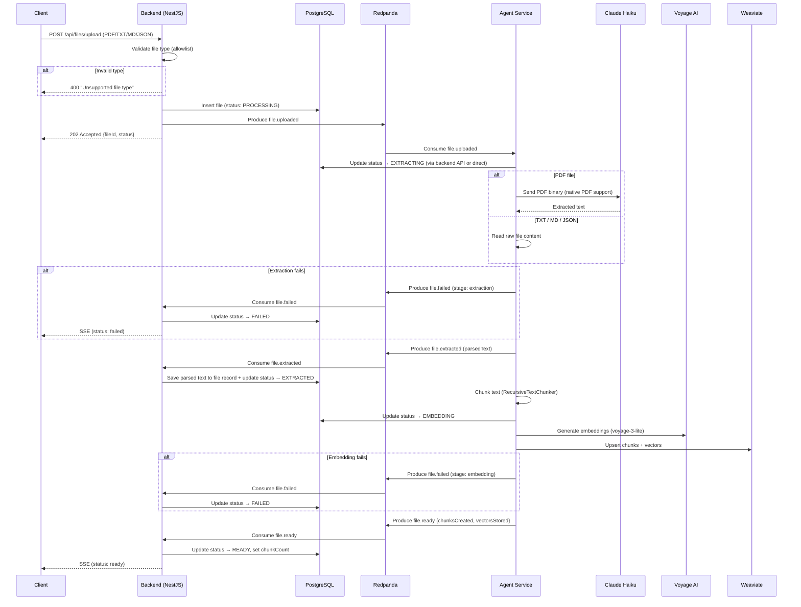

# Ingestion V2 — Revised File Processing Pipeline

Supersedes the ingestion sections in `architecture_plan.md` (Section 3) and `agent_plan.md` (A4, A7).

---

## Summary of Changes from V1

| Aspect                   | V1 (Current Plan)                             | V2 (This Plan)                                                 |
| ------------------------ | --------------------------------------------- | -------------------------------------------------------------- |
| Allowed formats          | Everything except video                       | **PDF, TXT, MD, JSON only**                                    |
| Text extraction          | Deterministic extractors (pdf-parse, mammoth) | **Haiku for PDF, raw read for TXT/MD/JSON**                    |
| File type enum           | `PDF, DOCX, TXT, CSV, JSON, MARKDOWN, OTHER`  | **PDF, TXT, JSON, MARKDOWN**                                   |
| Pipeline model           | Single atomic supervisor run                  | **Sequential agent pipeline with granular status**             |
| Intermediate persistence | None (agent does everything in memory)        | **Parsed text saved to Postgres after extraction**             |
| Status tracking          | `PROCESSING → READY/FAILED`                   | **`PROCESSING → EXTRACTING → EMBEDDING → READY/FAILED`**       |
| Kafka topics             | `file.uploaded → file.ready/file.failed`      | Same topics, plus **`file.extracted`** for parsed text handoff |
| DOCX support             | Via mammoth                                   | **Dropped**                                                    |

---

## 1. Allowed File Types

Only 4 file types are accepted for upload:

| Extension | MIME Types                         | Extraction Strategy                                     |
| --------- | ---------------------------------- | ------------------------------------------------------- |
| `.pdf`    | `application/pdf`                  | **Claude Haiku** (native PDF support via Anthropic API) |
| `.txt`    | `text/plain`                       | Raw text read                                           |
| `.md`     | `text/markdown`, `text/x-markdown` | Raw text read                                           |
| `.json`   | `application/json`                 | Raw text read                                           |

### Upload Validation (Backend)

Replace the current "reject video" filter with an allowlist:

```typescript
const ALLOWED_MIME_TYPES = new Set(['application/pdf', 'text/plain', 'text/markdown', 'text/x-markdown', 'application/json']);

const ALLOWED_EXTENSIONS = new Set(['.pdf', '.txt', '.md', '.json']);

fileFilter: (_req, file, cb) => {
  const ext = extname(file.originalname).toLowerCase();
  if (!ALLOWED_MIME_TYPES.has(file.mimetype) && !ALLOWED_EXTENSIONS.has(ext)) {
    cb(new BadRequestException(`Unsupported file type. Allowed: PDF, TXT, MD, JSON`), false);
  } else {
    cb(null, true);
  }
};
```

### FileType Enum Update

```typescript
export enum FileType {
  PDF = 'pdf',
  TXT = 'txt',
  MARKDOWN = 'markdown',
  JSON = 'json',
}
```

Remove `DOCX`, `CSV`, `OTHER` from the enum and the corresponding migration.

---

## 2. FileStatus Enum — Granular Tracking

```typescript
export enum FileStatus {
  PROCESSING = 'processing', // initial state after upload
  EXTRACTING = 'extracting', // agent started text extraction
  EXTRACTED = 'extracted', // text parsed, saved to DB
  EMBEDDING = 'embedding', // embedding + vector storage in progress
  READY = 'ready', // fully processed
  FAILED = 'failed', // error at any stage
}
```

Migration: alter `file_status_enum` to add `extracting`, `extracted`, `embedding`.

---

## 3. Text Extraction Strategy

### PDF — Claude Haiku

Use Anthropic's native PDF support to send the file directly to Haiku. This handles:

- Complex layouts and multi-column text
- Tables (preserved as structured text)
- OCR for scanned documents
- Headers/footers noise filtering

```typescript
async extractPdfWithHaiku(fileBuffer: Buffer, fileName: string): Promise<string> {
  const response = await anthropic.messages.create({
    model: 'claude-3-5-haiku-20241022',
    max_tokens: 16384,
    messages: [{
      role: 'user',
      content: [
        {
          type: 'document',
          source: {
            type: 'base64',
            media_type: 'application/pdf',
            data: fileBuffer.toString('base64'),
          },
        },
        {
          type: 'text',
          text: 'Extract all text content from this document. Preserve the structure: headings, paragraphs, lists, and tables. For tables, use markdown table format. Do not summarize or interpret — extract verbatim.',
        },
      ],
    }],
  });

  return response.content[0].type === 'text' ? response.content[0].text : '';
}
```

**Cost estimate**: ~$0.003–0.01 per typical document (10 pages). Haiku input: $1/MTok, output: $5/MTok.

**Size handling**: Anthropic supports up to ~100 pages per request. For larger PDFs, split into page batches.

### TXT / MD / JSON — Raw Read

No LLM call needed. Read the file bytes and decode as UTF-8:

```typescript
async extractRawText(filePath: string): Promise<string> {
  return fs.readFile(filePath, 'utf-8');
}
```

### Extraction Router

```typescript
async extractText(filePath: string, mimeType: string): Promise<string> {
  if (mimeType === 'application/pdf') {
    const buffer = await fs.readFile(filePath);
    return this.extractPdfWithHaiku(buffer, filePath);
  }
  return this.extractRawText(filePath);
}
```

---

## 4. Revised Kafka Topics

### Existing (unchanged)

| Topic           | Direction       | Purpose                    |
| --------------- | --------------- | -------------------------- |
| `file.uploaded` | Backend → Agent | Trigger ingestion pipeline |
| `file.ready`    | Agent → Backend | Ingestion complete         |
| `file.failed`   | Agent → Backend | Ingestion failed           |

### New

| Topic            | Direction       | Purpose                           |
| ---------------- | --------------- | --------------------------------- |
| `file.extracted` | Agent → Backend | Parsed text ready for persistence |

Add to `libs/events/src/lib/topics.ts`:

```typescript
export const TOPICS = {
  FILE_UPLOADED: 'file.uploaded',
  FILE_EXTRACTED: 'file.extracted', // NEW
  FILE_READY: 'file.ready',
  FILE_FAILED: 'file.failed',
  CHAT_REQUEST: 'chat.request',
} as const;
```

### New Event Schema: `file-extracted.event.ts`

```typescript
export interface FileExtractedEvent {
  fileId: string;
  tenantId: string;
  parsedText: string;
  extractionMethod: 'haiku' | 'raw';
  pageCount?: number;
  characterCount: number;
  timestamp: string;
}
```

---

## 5. Revised Ingestion Flow



### Key Design Decisions

1. **Agent does NOT consume its own events.** The pipeline runs sequentially within the agent after consuming `file.uploaded`. The `file.extracted` event is a notification to the backend only — the agent proceeds directly to chunking/embedding without waiting for the backend.

2. **`file.extracted` is fire-and-forget from the agent's perspective.** The agent publishes it and immediately continues with chunking. The backend consumes it asynchronously to persist the parsed text. If the backend save fails, it doesn't block the pipeline.

3. **Status updates go through Kafka events**, not direct DB writes from the agent. The backend is the sole owner of PostgreSQL writes. The agent publishes events, and the backend updates statuses accordingly.

---

## 6. Backend Changes

### New Kafka Consumer Handler

Add `FILE_EXTRACTED` to `KafkaConsumerService`:

```typescript
case TOPICS.FILE_EXTRACTED:
  await this.filesService.saveExtractedText(value.fileId, {
    parsedText: value.parsedText,
    extractionMethod: value.extractionMethod,
    characterCount: value.characterCount,
    pageCount: value.pageCount,
  });
  break;
```

### FileEntity Schema Update

Add `parsedText` column to `FileEntity`:

```typescript
@Column({ type: 'text', nullable: true })
parsedText: string;

@Column({ type: 'varchar', length: 20, nullable: true })
extractionMethod: 'haiku' | 'raw';
```

Migration: add `parsed_text TEXT` and `extraction_method VARCHAR(20)` columns to `files` table.

### FilesService — New Method

```typescript
async saveExtractedText(fileId: string, data: {
  parsedText: string;
  extractionMethod: 'haiku' | 'raw';
  characterCount: number;
  pageCount?: number;
}): Promise<void> {
  await this.fileRepo.update(fileId, {
    parsedText: data.parsedText,
    extractionMethod: data.extractionMethod,
    status: FileStatus.EXTRACTED,
  });
  this.emitStatusEvent(fileId, FileStatus.EXTRACTED);
}
```

---

## 7. Agent Changes

### Extract Text Tool Update

Replace `ExtractorRegistry` usage with the hybrid strategy:

```typescript
execute: async ({ filePath, mimeType, fileName }) => {
  let text: string;
  let method: 'haiku' | 'raw';

  if (mimeType === 'application/pdf') {
    const buffer = await fs.readFile(filePath);
    text = await extractPdfWithHaiku(buffer, fileName);
    method = 'haiku';
  } else {
    text = await fs.readFile(filePath, 'utf-8');
    method = 'raw';
  }

  return { text, method, characterCount: text.length };
};
```

### Ingestion Consumer Update

After extraction, publish `file.extracted` then continue to chunking/embedding:

```typescript
@EventPattern(TOPICS.FILE_UPLOADED)
async handleFileUploaded(@Payload() event: FileUploadedEvent): Promise<void> {
  try {
    const { text, method } = await this.extractText(event.storagePath, event.mimeType);

    await this.kafkaEventAdapter.publishFileExtracted({
      fileId: event.fileId,
      tenantId: event.tenantId,
      parsedText: text,
      extractionMethod: method,
      characterCount: text.length,
    });

    const chunks = this.chunker.chunk(text);

    await this.embeddingAdapter.embedAndStore(chunks, metadata, event.tenantId);

    await this.kafkaEventAdapter.publishFileReady({
      fileId: event.fileId,
      tenantId: event.tenantId,
      chunksCreated: chunks.length,
    });
  } catch (error) {
    const stage = error instanceof AgentProcessingError ? error.stage : 'extraction';
    await this.kafkaEventAdapter.publishFileFailed({
      fileId: event.fileId,
      tenantId: event.tenantId,
      error: error.message,
      stage,
    });
  }
}
```

### KafkaEventAdapter — New Method

```typescript
async publishFileExtracted(event: FileExtractedEvent): Promise<void> {
  await this.producer.send({
    topic: TOPICS.FILE_EXTRACTED,
    messages: [{
      key: event.tenantId,
      value: JSON.stringify(event),
    }],
  });
}
```

---

## 8. Config & Environment

### New Environment Variables

```
ANTHROPIC_HAIKU_MODEL=claude-3-5-haiku-20241022   # for PDF extraction
```

Add to `apps/agent/src/config/agent-config.schema.ts`.

### Dependencies

No new dependencies needed — `@ai-sdk/anthropic` is already installed. The Haiku call uses the Anthropic SDK directly (not Vercel AI SDK) for native PDF support via the `document` content block.

Verify `@anthropic-ai/sdk` is installed (needed for native PDF API):

```
@anthropic-ai/sdk
```

---

## 9. Migration Checklist

- [ ] Update `file_status_enum` in Postgres: add `extracting`, `extracted`, `embedding`
- [ ] Update `file_type_enum` in Postgres: remove `docx`, `csv`, `other`; keep `pdf`, `txt`, `json`, `markdown`
- [ ] Add `parsed_text TEXT` column to `files` table
- [ ] Add `extraction_method VARCHAR(20)` column to `files` table
- [ ] Update Multer fileFilter to allowlist (PDF, TXT, MD, JSON)
- [ ] Add `FILE_EXTRACTED` topic to `libs/events/src/lib/topics.ts`
- [ ] Create `FileExtractedEvent` schema in `libs/events/src/schemas/`
- [ ] Update `KafkaConsumerService` to handle `file.extracted`
- [ ] Update agent extract-text tool with Haiku/raw hybrid
- [ ] Update ingestion consumer to publish `file.extracted`
- [ ] Update `KafkaEventAdapter` with `publishFileExtracted`
- [ ] Remove DOCX/mammoth extractor from `libs/core`
- [ ] Update Swagger docs for upload endpoint (accepted types)
- [ ] Add `ANTHROPIC_HAIKU_MODEL` to config schema
