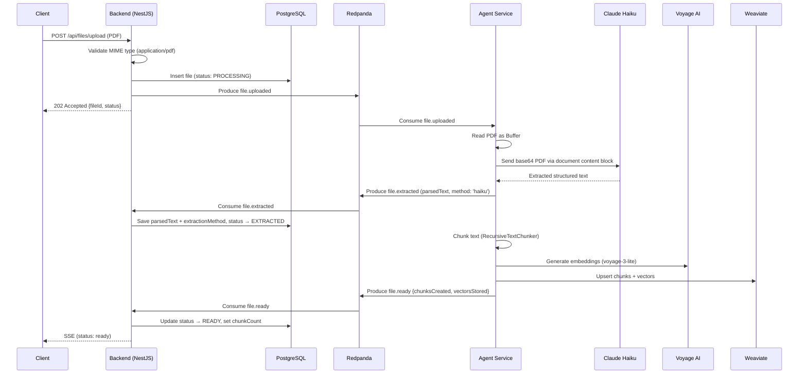

# PDF-to-Text Extraction via Claude API

## Summary

When a PDF file is uploaded, the system parses it to structured text using Claude's native PDF document support (Anthropic API). This replaces the legacy `pdf-parse` library approach with an intelligent extraction pipeline that handles complex layouts, tables, OCR, and multi-column text.

---

## Architecture

---

## Key Design Decisions

1. **Claude Haiku for PDF extraction** — Uses Anthropic's native `document` content block type with base64-encoded PDF. This provides superior quality over `pdf-parse` for complex layouts, scanned documents, and tables.

2. **Extraction method tracking** — Each file records its `extractionMethod` (`'haiku'` for PDF, `'raw'` for TXT/MD/JSON) in Postgres for observability.

3. **Error classification** — API errors (rate limits, timeouts) are marked `retryable: true`; content errors (empty text, missing file) are `retryable: false`.

4. **Fire-and-forget `file.extracted`** — The agent publishes the extracted text event and immediately proceeds to chunking/embedding without waiting for the backend to persist it.

---

## Configuration

| Variable | Default | Purpose |
|----------|---------|---------|
| `ANTHROPIC_API_KEY` | (required) | Anthropic API authentication |
| `ANTHROPIC_HAIKU_MODEL` | `claude-haiku-4-5-20250414` | Model used for PDF extraction |

---

## Tickets

| ID | Title | Points | Status |
|----|-------|--------|--------|
| PCE-01 | PDF-to-Text Extraction via Claude API | 5 | Done |
