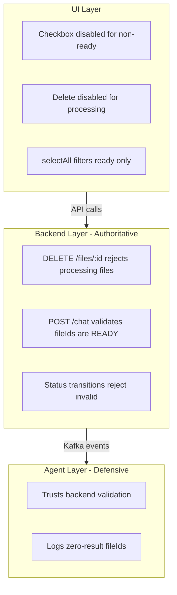

# Processing Guardrails — Prevent Interaction with In-Progress Files

Adds guardrails across UI, backend, and agent layers to prevent users from interacting with files that are still being processed (delete, chat context).

---

## Summary of Gaps

| Gap | Layer | Risk |
|-----|-------|------|
| DELETE endpoint has no status check | Backend | Orphaned Weaviate vectors, crashed ingestion pipeline |
| Chat accepts non-ready fileIds | Backend | Empty/partial search results, confusing agent responses |
| Delete button visible on processing files | UI | Users trigger the unguarded DELETE |
| Status transitions are warn-only | Backend | Data corruption from race conditions |
| Agent tools unaware of file status | Agent | Partial results if backend guard is bypassed |

---

## 1. Backend — Enforce at the API Boundary

### a) Guard DELETE Endpoint

In `files.service.ts`, reject deletion if the file status is `processing`, `extracting`, `extracted`, or `embedding`. Only `ready`, `failed`, and `pending` files can be deleted. Return `409 Conflict`.

```typescript
const NON_DELETABLE = [
  FileStatus.PROCESSING,
  FileStatus.EXTRACTING,
  FileStatus.EXTRACTED,
  FileStatus.EMBEDDING,
];

async remove(id: string): Promise<void> {
  const file = await this.findOne(id);
  if (NON_DELETABLE.includes(file.status)) {
    throw new ConflictException(`Cannot delete file while it is ${file.status}`);
  }
  await this.chunkRepo.delete({ fileId: file.id });
  await this.fileRepo.remove(file);
}
```

### b) Guard Chat fileIds

In `chat.service.ts`, before publishing `chat.request`, validate that every `fileId` is in `READY` status. Inject `FileEntity` repository and query. Return `400 Bad Request` with the list of non-ready file names.

```typescript
if (dto.fileIds?.length) {
  const nonReady = await this.fileRepo.find({
    where: { id: In(dto.fileIds), status: Not(FileStatus.READY) },
    select: ['id', 'name', 'status'],
  });
  if (nonReady.length > 0) {
    throw new BadRequestException(
      `Files not ready: ${nonReady.map(f => f.name).join(', ')}`,
    );
  }
}
```

### c) Strict Status Transitions

In `files.service.ts`, change `updateStatus()` to throw on invalid transitions instead of logging and proceeding.

---

## 2. UI — Disable Dangerous Actions

### a) Disable Delete for Processing Files

In `file-item.tsx`, disable the trash button when the file is in a non-deletable state. Show a tooltip explaining why.

### b) Store-Level Guard

In `files-store.ts`, add a client-side check in `removeFile` — skip the API call if the file is still processing. Defense-in-depth on top of the backend guard.

### c) Chat Context (No Change Needed)

File selection checkbox is already disabled for non-ready files. The backend guard catches edge cases.

---

## 3. Agent — Defensive Logging

In `chat.consumer.ts`, log a warning when a provided `fileId` returns zero search results. The backend is the authoritative gatekeeper; the agent trusts incoming fileIds but logs anomalies for debugging.

---

## Architecture



---

## Tickets

| Ticket | Title | Points | Priority |
|--------|-------|--------|----------|
| PG-01 | Backend delete guard + strict transitions | 3 | P1 |
| PG-02 | Backend chat fileIds validation | 3 | P1 |
| PG-03 | UI delete guard + store guard | 2 | P2 |
| PG-04 | Agent defensive logging | 1 | P3 |
