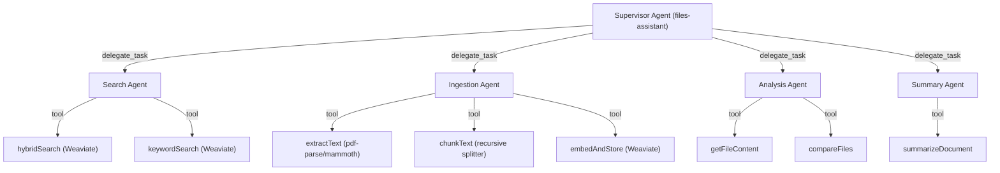
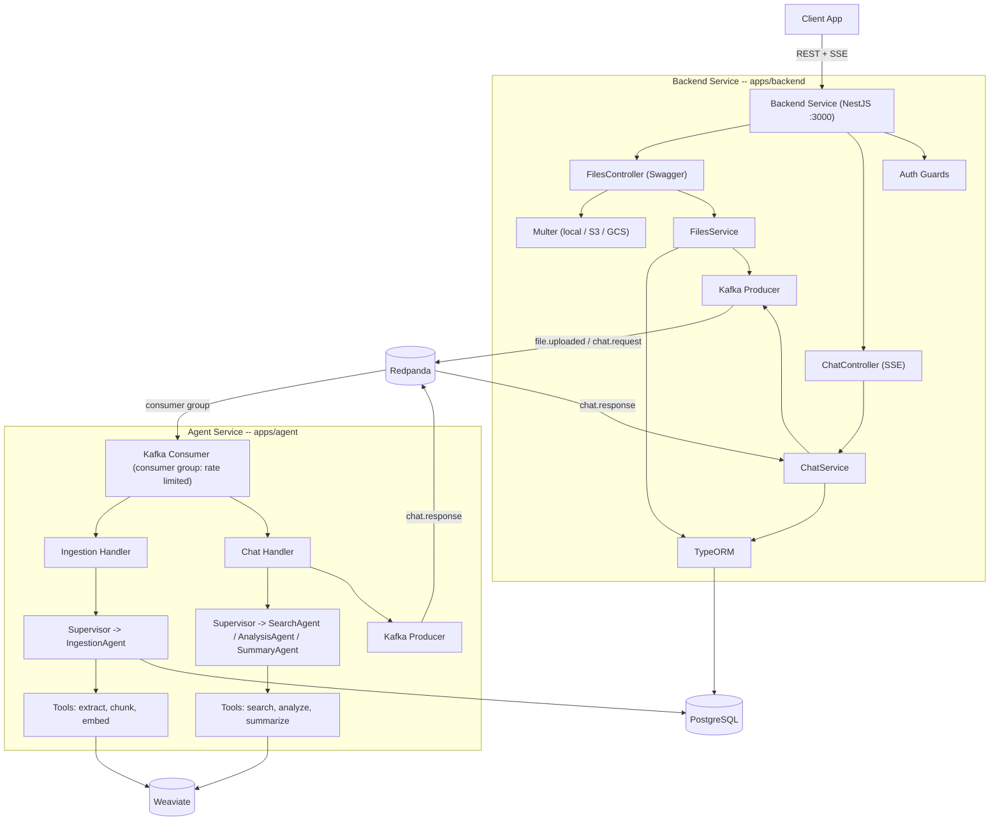
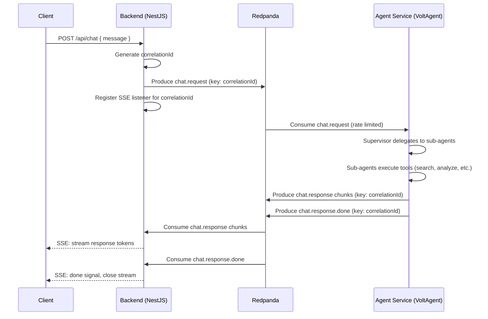
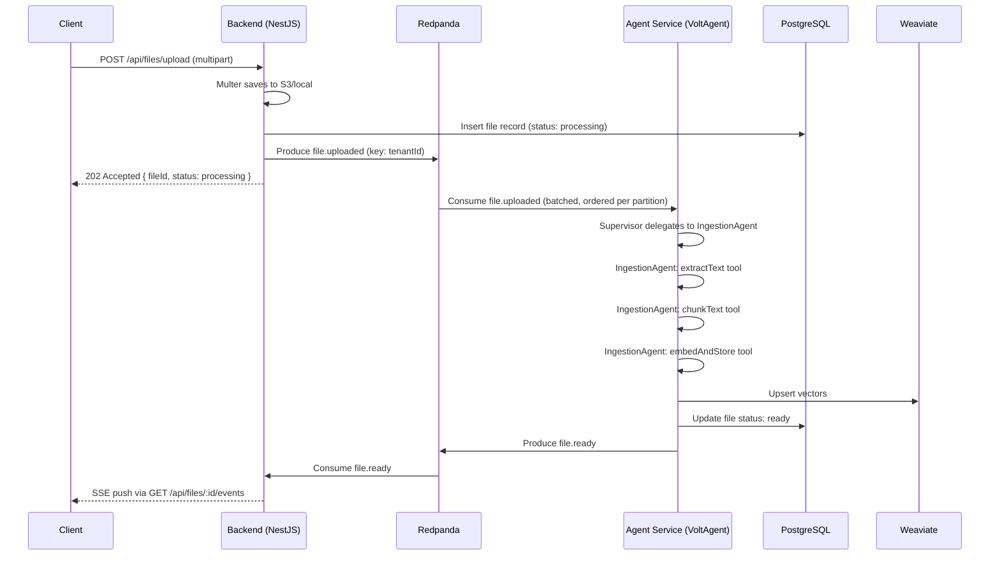

# Technical Proposal: AI Files Assistant

## Overview

An AI-powered files assistant that enables semantic search and Q&A over uploaded documents. Users upload files (PDF, DOCX, plain text), the system extracts, chunks, and embeds the content, then a multi-agent AI system answers natural language questions grounded in the retrieved context (RAG).

The system is split into two independent services communicating through Redpanda (Kafka): a **backend** for CRUD operations and an **agent** running a VoltAgent multi-agent architecture. Consumer group configuration on the agent side acts as a rate limiter for all AI work.

---

## Tech Stack

| Layer | Technology | Purpose |
|-------|-----------|---------|
| Monorepo | **Nx** | Enforced module boundaries, incremental builds, separate app/lib targets |
| Backend Service | **NestJS** | CRUD API -- Multer file uploads, Swagger (OpenAPI), SSE streaming, class-validator, TypeORM |
| Agent Service | **VoltAgent** (`@voltagent/core`) | Multi-agent architecture -- supervisor + specialized sub-agents with Zod-typed tools |
| Agent Dev Server | **VoltAgent** (`@voltagent/server-hono`) | Standalone dev server with VoltOps live dashboard for isolated LLM testing |
| Vector DB | **Weaviate** (`weaviate-client` v3) | Vector storage, hybrid search (BM25 + vector) |
| Relational DB | **PostgreSQL + TypeORM** | Structured data (files, chunks, users, conversations), migrations |
| Event Streaming | **Redpanda** (Kafka-compatible) | Service communication, async ingestion, rate limiting via consumer groups |
| Document Processing | **pdf-parse**, **mammoth** | Text extraction from PDF and DOCX (no LangChain) |

### Why No LangChain / LangGraph

VoltAgent's multi-agent system (supervisor + sub-agents with `delegate_task`) covers all orchestration needs that LangGraph would provide. Direct libraries replace LangChain utilities:

| LangChain Would Provide | Replaced By | Rationale |
|---|---|---|
| Agent orchestration | VoltAgent supervisor + sub-agents | Native TypeScript, Zod-typed tools, VoltOps observability |
| Graph workflows | VoltAgent conditional delegation | Supervisor LLM routes to agents; no explicit graph needed |
| Document loaders | `pdf-parse`, `mammoth` | Lighter, zero transitive deps, full control |
| Text splitters | Custom recursive chunker in `libs/core` | Tunable for file-assistant domain |
| Embeddings | OpenAI SDK via VoltAgent model providers | VoltAgent supports `openai/text-embedding-3-small` natively |
| Vector store | `weaviate-client` v3 | Typed gRPC SDK, hybrid search, no wrapper needed |

Removing LangChain eliminates ~150+ transitive dependencies and keeps the agent service lean.

---

## Multi-Agent Architecture

The agent service runs a VoltAgent supervisor that coordinates specialized sub-agents. Each sub-agent focuses on a single domain with its own tools and instructions.



### Agent Definitions

```typescript
// apps/agent/src/agents/supervisor.agent.ts
import { Agent, createSubagent } from '@voltagent/core';

const searchAgent = new Agent({
  name: 'SearchAgent',
  purpose: 'Semantic and keyword search over uploaded files',
  instructions: `You search the user's uploaded documents using hybrid search.
    Use hybridSearch for natural language queries.
    Use keywordSearch when the user asks for exact filenames or terms.`,
  model: 'openai/gpt-4o-mini',
  tools: [hybridSearchTool, keywordSearchTool],
});

const ingestionAgent = new Agent({
  name: 'IngestionAgent',
  purpose: 'Process uploaded files: extract text, chunk, embed, store vectors',
  instructions: `You process uploaded files through the ingestion pipeline.
    Extract text based on file type. Chunk using recursive splitting.
    Generate embeddings and store in Weaviate.`,
  model: 'openai/gpt-4o-mini',
  tools: [extractTextTool, chunkTextTool, embedAndStoreTool],
});

const analysisAgent = new Agent({
  name: 'AnalysisAgent',
  purpose: 'Deep analysis and comparison of file contents',
  instructions: `You analyze file contents in detail. You can retrieve full
    file content and compare multiple files.`,
  model: 'openai/gpt-4o-mini',
  tools: [getFileContentTool, compareFilesTool],
});

const summaryAgent = new Agent({
  name: 'SummaryAgent',
  purpose: 'Summarize documents at different levels of detail',
  instructions: `You produce concise summaries of documents. Adapt summary
    length and detail level based on user request.`,
  model: 'openai/gpt-4o-mini',
  tools: [summarizeDocumentTool],
});

export const supervisorAgent = new Agent({
  name: 'FilesAssistant',
  instructions: `You are a files assistant. You coordinate specialized agents
    to help users search, analyze, and understand their uploaded documents.
    Delegate to the appropriate agent based on the user's request.`,
  model: 'openai/gpt-4o',
  subAgents: [searchAgent, ingestionAgent, analysisAgent, summaryAgent],
  supervisorConfig: {
    customGuidelines: [
      'For search queries, delegate to SearchAgent',
      'For file processing events, delegate to IngestionAgent',
      'For detailed analysis or comparison, delegate to AnalysisAgent',
      'For summarization requests, delegate to SummaryAgent',
      'You may delegate to multiple agents if the request requires it',
    ],
    includeAgentsMemory: true,
    fullStreamEventForwarding: {
      types: ['tool-call', 'tool-result', 'text-delta'],
    },
  },
  hooks: {
    onHandoffComplete: async ({ agent, result, bail }) => {
      // IngestionAgent produces final status -- skip supervisor processing
      if (agent.name === 'IngestionAgent') {
        bail();
      }
    },
  },
});
```

### How Delegation Works

1. Kafka consumer receives `chat.request` event
2. Passes message to the supervisor agent via `supervisorAgent.streamText()`
3. Supervisor LLM analyzes request and decides which sub-agent(s) to delegate to
4. Supervisor calls `delegate_task` (auto-injected tool) with task + target agents
5. Sub-agent(s) execute using their own tools (search, extract, analyze, etc.)
6. Results flow back to supervisor, which synthesizes the final response
7. Response produced back to Redpanda as `chat.response` events

For ingestion tasks, the `onHandoffComplete` hook calls `bail()` -- the IngestionAgent's result is returned directly without supervisor re-processing (saves tokens).

---

## Service Architecture



### Why Two Services

| Concern | Backend (NestJS) | Agent (VoltAgent multi-agent) |
|---------|-----------------|-------------------------------|
| Responsibility | CRUD, auth, file storage, API docs | AI processing, RAG, multi-agent orchestration |
| Scaling | Scale with HTTP traffic | Scale with AI workload (independent) |
| Failure isolation | Agent crash does not take down API | Backend crash does not lose queued work |
| Rate limiting | N/A | Consumer group config controls concurrency |
| Deployment | Standard Node.js container | GPU-optional container, separate resource limits |
| Dependencies | NestJS, TypeORM, Multer | VoltAgent, weaviate-client, pdf-parse |

---

## Kafka Event Design

All service communication flows through Redpanda. The agent service's consumer group configuration controls concurrency -- acting as a rate limiter for all AI work.

### Topics

| Topic | Key | Producer | Consumer Group | Purpose |
|-------|-----|----------|---------------|---------|
| `file.uploaded` | `tenantId` | Backend | `agent-ingestion` | Trigger file ingestion pipeline |
| `file.ready` | `tenantId` | Agent | `backend-notifications` | Notify backend that file is searchable |
| `file.failed` | `tenantId` | Agent | `backend-notifications` | Notify backend of ingestion failure |
| `chat.request` | `correlationId` | Backend | `agent-chat` | Send chat message to agent |
| `chat.response` | `correlationId` | Agent | `backend-chat-reply` | Stream agent response chunks |
| `chat.response.done` | `correlationId` | Agent | `backend-chat-reply` | Signal end of streaming |

### Consumer Group Rate Limiting

```typescript
// apps/agent/src/main.ts
const app = await NestFactory.createMicroservice<MicroserviceOptions>(AgentModule, {
  transport: Transport.KAFKA,
  options: {
    client: {
      brokers: [config.get('REDPANDA_BROKER')],
      clientId: 'agent-service',
    },
    consumer: {
      groupId: 'agent-workers',
      sessionTimeout: 30000,
    },
    run: {
      partitionsConsumedConcurrently: 3,
    },
  },
});
```

Scaling: add more agent instances to the same consumer group. Redpanda rebalances partitions automatically. Per-tenant ordering preserved.

### Request-Reply Pattern for Chat



### Batch Ingestion Flow



---

## Architecture Decisions

### ADR-001: Nx Monorepo

**Context:** Two deployable services + dev server, sharing core libraries.
**Decision:** Nx with `@nx/enforce-module-boundaries`.
**Consequences:** Enforced layering at lint time. `nx affected` for incremental CI.

### ADR-002: Separated Backend + Agent Services

**Context:** AI processing is CPU/GPU-intensive with external API rate limits. CRUD is lightweight.
**Decision:** Two independent services communicating through Redpanda.
**Consequences:** Independent scaling, failure isolation, consumer group rate limiting.

### ADR-003: VoltAgent Multi-Agent over LangChain/LangGraph

**Context:** The agent needs to orchestrate multiple specialized capabilities (search, ingest, analyze, summarize). LangChain/LangGraph and VoltAgent both offer orchestration.

**Decision:** VoltAgent multi-agent (supervisor + sub-agents). No LangChain. No LangGraph.

**Consequences:**
- Supervisor pattern with `delegate_task` auto-routing -- no explicit graph definition needed.
- Sub-agents with Zod-typed tools -- compile-time safety on all tool inputs/outputs.
- `bail()` hook for token optimization (IngestionAgent returns directly, saves ~79% tokens).
- VoltOps observability traces every delegation with supervisor/sub-agent attribution.
- Dynamic sub-agents -- add/remove at runtime without restart.
- ~150 fewer transitive dependencies vs LangChain.
- Trade-off: no LangGraph's explicit graph visualization. VoltAgent's delegation is LLM-driven, not graph-defined. Mitigated by clear `customGuidelines` in supervisor config.

### ADR-004: Weaviate over pgvector

**Context:** Vector search needed for semantic retrieval.
**Decision:** Weaviate as a dedicated vector database.
**Consequences:** Hybrid search, multi-tenancy, dedicated scaling. Two databases to operate.

### ADR-005: Redpanda over Redis + BullMQ

**Context:** Async processing with ordering + rate limiting.
**Decision:** Redpanda (Kafka-compatible, single binary).
**Consequences:** Ordered-per-tenant parallelism, event replay, multi-consumer, consumer group rate limiting.

### ADR-006: REST + SSE over GraphQL

**Context:** API needs file CRUD, streaming chat, status updates.
**Decision:** REST-only with Swagger + SSE.
**Consequences:** Single documentation surface, SSE for streaming, OpenAPI spec for SDK generation.

### ADR-007: Ports and Adapters

**Context:** `libs/core` must be pure TypeScript.
**Decision:** Port interfaces in core, adapters in each app.
**Consequences:** Testable, swappable, framework-agnostic core.

---

## Project Structure

```
files-assistant/
  nx.json
  tsconfig.base.json
  docker-compose.yml                     -- PostgreSQL + Weaviate + Redpanda
  .github/workflows/ci.yml
  docs/
    technical proposal.md                -- this document
    adr/
      001-nx-monorepo.md
      002-separated-services.md
      003-voltagent-multi-agent.md
      004-weaviate-over-pgvector.md
      005-redpanda-event-streaming.md
      006-rest-only-over-graphql.md
      007-ports-adapters-pattern.md

  apps/
    backend/                             -- NestJS: CRUD API + Kafka producer
      src/
        main.ts
        app.module.ts
        modules/
          files/
            files.module.ts
            files.controller.ts          -- Swagger: upload, list, get, delete, events (SSE)
            files.service.ts             -- CRUD + produces file.uploaded
            dto/
              upload-file.dto.ts
              search-files.dto.ts
              file-response.dto.ts
            entities/
              file.entity.ts
              chunk.entity.ts
          chat/
            chat.module.ts
            chat.controller.ts           -- POST /chat + SSE /chat/stream
            chat.service.ts              -- produces chat.request, consumes chat.response
            dto/
              chat-message.dto.ts
              chat-response.dto.ts
            entities/
              conversation.entity.ts
              message.entity.ts
          kafka/
            kafka.module.ts
            kafka.producer.ts            -- typed event publisher
            kafka.consumer.ts            -- reply consumer (chat.response, file.ready)
          auth/
            auth.module.ts
          health/
            health.module.ts
          storage/
            storage.module.ts
            local-storage.adapter.ts
            s3-storage.adapter.ts
          config/
            config.module.ts
            config.schema.ts
        common/
          interceptors/
          filters/
          pipes/
      project.json

    agent/                               -- VoltAgent multi-agent + Kafka consumer
      src/
        main.ts                          -- NestJS microservice (Kafka transport)
        agent.module.ts
        consumers/
          ingestion.consumer.ts          -- file.uploaded -> supervisor -> IngestionAgent
          chat.consumer.ts               -- chat.request -> supervisor -> sub-agents -> chat.response
        agents/
          supervisor.agent.ts            -- supervisor with sub-agents
          search.agent.ts                -- SearchAgent definition + tools
          ingestion.agent.ts             -- IngestionAgent definition + tools
          analysis.agent.ts              -- AnalysisAgent definition + tools
          summary.agent.ts               -- SummaryAgent definition + tools
        tools/
          hybrid-search.tool.ts          -- Zod-typed: query Weaviate hybrid search
          keyword-search.tool.ts         -- Zod-typed: exact keyword search
          extract-text.tool.ts           -- Zod-typed: pdf-parse / mammoth extraction
          chunk-text.tool.ts             -- Zod-typed: recursive text chunking
          embed-and-store.tool.ts        -- Zod-typed: embed + upsert to Weaviate
          get-file-content.tool.ts       -- Zod-typed: retrieve full file content
          compare-files.tool.ts          -- Zod-typed: diff two files
          summarize-document.tool.ts     -- Zod-typed: generate summary
        adapters/
          weaviate.adapter.ts            -- Weaviate client for tools
          postgres.adapter.ts            -- TypeORM for status updates
          kafka-response.adapter.ts      -- produces chat.response events
        config/
          agent-config.module.ts
          agent-config.schema.ts
      project.json

    agent-dev/                           -- VoltAgent standalone dev server
      src/
        main.ts                          -- VoltAgent + Hono + VoltOps (:3141)
        dev-adapters.ts                  -- stub implementations for isolated testing
      project.json

  libs/
    core/                                -- PURE TypeScript. Zero framework imports.
      src/
        ports/
          search.port.ts
          storage.port.ts
          embedding.port.ts
        types/
          file.types.ts
          chat.types.ts
          agent.types.ts
        extraction/
          extractor.interface.ts
          pdf.extractor.ts
          docx.extractor.ts
          plaintext.extractor.ts
          extractor.registry.ts
        chunking/
          chunker.interface.ts
          recursive-text.chunker.ts
        index.ts
      project.json
      jest.config.ts

    events/                              -- Kafka event schemas (shared)
      src/
        topics.ts
        schemas/
          file-uploaded.event.ts
          file-ready.event.ts
          file-failed.event.ts
          chat-request.event.ts
          chat-response.event.ts
        index.ts
      project.json

    weaviate/                            -- Weaviate client wrapper (shared)
      src/
        weaviate.config.ts
        weaviate.client.ts
        collections/
          file-chunks.collection.ts
        index.ts
      project.json
```

---

## REST API Surface

All endpoints on the backend service, documented via `@nestjs/swagger`.

### Files

| Method | Path | Description | Response |
|--------|------|-------------|----------|
| `POST` | `/api/files/upload` | Multipart file upload (Multer) | `202 Accepted` `{ fileId, status }` |
| `GET` | `/api/files` | List files (paginated, filterable) | `200 OK` `{ data, meta }` |
| `GET` | `/api/files/:id` | File details + processing status | `200 OK` `{ file }` |
| `DELETE` | `/api/files/:id` | Delete file + vectors + chunks | `204 No Content` |
| `GET` | `/api/files/:id/events` | SSE: processing status updates | `text/event-stream` |

### Chat

| Method | Path | Description | Response |
|--------|------|-------------|----------|
| `POST` | `/api/chat` | Send message, receive complete response | `200 OK` `{ response }` |
| `GET` | `/api/chat/stream` | SSE: stream agent response tokens | `text/event-stream` |
| `GET` | `/api/chat/history` | Conversation history (paginated) | `200 OK` `{ data, meta }` |

### System

| Method | Path | Description | Response |
|--------|------|-------------|----------|
| `GET` | `/api/health` | Liveness probe | `200 OK` |
| `GET` | `/api/ready` | Readiness (PG + Weaviate + Redpanda) | `200 OK` / `503` |

---

## Testing Strategy

| Tier | Scope | Location | What it tests | Command |
|------|-------|----------|--------------|---------|
| Unit | Pure logic | `libs/core/` | Extraction, chunking, event schemas | `nx test core` |
| Unit | Events | `libs/events/` | Event serialization/deserialization | `nx test events` |
| Integration | Backend | `apps/backend/` | File CRUD, Kafka producing, SSE | `nx test backend` |
| Integration | Agent | `apps/agent/` | Multi-agent delegation, tool execution | `nx test agent` |
| E2E | Full flow | `apps/backend-e2e/` | Upload -> ingest -> search -> chat | `nx e2e backend-e2e` |
| Agent Eval | LLM | `apps/agent-dev/` | Tool selection, response grounding | VoltAgent eval framework |

---

## Nx Commands

```bash
# Development
nx serve backend                      # NestJS API (:3000)
nx serve agent                        # Kafka consumer agent
nx serve agent-dev                    # VoltAgent + VoltOps dashboard (:3141)

# Build
nx build backend --configuration=production
nx build agent --configuration=production

# Test
nx test core                          # libs unit tests
nx test events                        # event schema tests
nx test backend                       # backend tests
nx test agent                         # agent tests
nx e2e backend-e2e                    # end-to-end
nx affected -t lint,test,build        # CI: only what changed
nx graph                              # dependency visualization
```

---

## Infrastructure (Docker Compose)

```yaml
services:
  postgres:
    image: postgres:16-alpine
    ports: ['5432:5432']
    environment:
      POSTGRES_DB: files_assistant
      POSTGRES_USER: postgres
      POSTGRES_PASSWORD: postgres

  weaviate:
    image: cr.weaviate.io/semitechnologies/weaviate:latest
    ports: ['8080:8080', '50051:50051']
    environment:
      AUTHENTICATION_ANONYMOUS_ACCESS_ENABLED: 'true'
      PERSISTENCE_DATA_PATH: '/var/lib/weaviate'
      DEFAULT_VECTORIZER_MODULE: 'none'

  redpanda:
    image: redpandadata/redpanda:latest
    command:
      - redpanda start
      - --smp 1
      - --memory 512M
      - --overprovisioned
      - --kafka-addr internal://0.0.0.0:9092,external://0.0.0.0:19092
      - --advertise-kafka-addr internal://redpanda:9092,external://localhost:19092
    ports:
      - '19092:19092'
      - '8081:8081'
```

One command: `docker compose up`.

---

## Build Phases

### Phase 0 -- Foundation
Nx scaffold (`apps/backend`, `apps/agent`, `apps/agent-dev`, `libs/core`, `libs/events`, `libs/weaviate`). Docker Compose. CI pipeline. Typed env config. Health checks.

### Phase 1 -- Shared Libraries
`libs/core`: ports, types, extraction, chunking.
`libs/events`: topic constants, typed event schemas.
`libs/weaviate`: client wrapper, collection schema.

### Phase 2 -- Backend Service
`apps/backend`: NestJS CRUD API, Multer uploads, Kafka producer, Swagger docs, TypeORM entities + migrations, SSE endpoints.

### Phase 3 -- Agent Service
`apps/agent`: Kafka consumer, VoltAgent multi-agent (supervisor + 4 sub-agents), Zod-typed tools (search, extract, chunk, embed, analyze, summarize), response producer.

### Phase 4 -- Agent Dev Server
`apps/agent-dev`: VoltAgent standalone with VoltOps dashboard, same multi-agent system with stub adapters.

### Phase 5 -- Quality
Unit tests (core, events), integration tests (backend, agent), E2E tests, ADRs, README, working demo flow.
